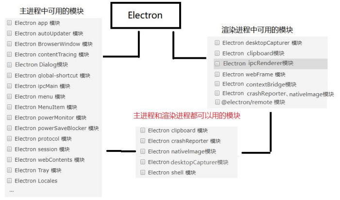
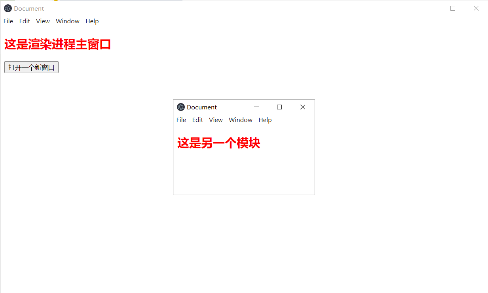

## Electron 主进程和渲染进程中的模块

[官方文档]: https://www.electronjs.org/zh/docs/latest/api/app



## remote模块

主要作用：提供了一种在渲染进程（网页）和主进程之间进行进程间通讯（IPC）的简便途径

例子：在渲染进程（index.html）中创建新的窗口

注意：

* Electron10.x 之前可以直接使用 remote 模块
* Electron10.x 以后 Electron14.x 以前要使用 remote 模块的话必须得在 BrowserWindow 中通过 enableRemoteModule: true 开启
* Electron14.x 以后官方把内置的 remote 挪到了第三方模块里面

/2.png)


## 例子：在渲染进程中创建新的窗口

1、安装 @electron/remote

```javascript
npm install --save @electron/remote
// 或者
cnpm install --save @electron/remote
// 或者
yarn add @electron/remote
```

2、在配置`main.js`进行配置

```javascript
const { app, BrowserWindow } = require("electron");
const path = require("path");
//1、引入初始化remote模块
const remote=require('@electron/remote/main');
remote.initialize();

const createWindow = () => {
    const mainWindow = new BrowserWindow({
        width: 1000,
        height: 600,
        webPreferences: {            
            nodeIntegration: true,   //允许渲染进程使用nodejs
            contextIsolation: false  //允许渲染进程使用nodejs
        }
    });
    mainWindow.loadFile(path.join(__dirname, "index.html"));
    
    // 加载外部链接
    // mainWindow.loadURL("https://www.itying.com")
  
    //2、启动remote模块
    remote.enable(mainWindow.webContents);
}


app.on("ready", createWindow)


app.on('window-all-closed', () => {
    if (process.platform !== 'darwin') {
        app.quit();
    }
});


app.on('activate', () => {
    if (BrowserWindow.getAllWindows().length === 0) {
        createWindow();
    }
});
```

3、在`main.js`引入处理函数

```html
<!DOCTYPE html>
<html lang="en">
<head>
    <script src="renderer/index.js"></script>       
</head>
<body>
    <h2>这是渲染进程主窗口</h2>
   <button id="btn">打开一个新窗口</button>
</body>
</html>
```

4、在 `renderer/index.js` 创建窗口

```javascript
const {  BrowserWindow } = require("@electron/remote");
const path = require("path");
window.onload=()=>{
    var btnDom=document.querySelector("#btn")
    btnDom.onclick=()=>{
        const secondWindow = new BrowserWindow({
            width: 300,
            height: 200,         
        });
        secondWindow.loadFile(path.join(__dirname, "second.html"));
    }
}
```



## 安全策略 Content-Security-Policy

CSP 的实质就是白名单制度，开发者明确告诉客户端，哪些外部资源可以加载和执行，等同于提供白名单。它的实现和执行全部由浏览器完成，开发者只需提供配置。 

CSP 大大增强了网页的安全性。攻击者即使发现了漏洞，也没法注入脚本，除非还控制了一 台列入了白名单的可信主机。 

通俗的讲开启 CSP 后可以让浏览器自动禁止外部注入恶意脚本，增加网站的安全性能。

从 2.0 版本开始，如果使用 electron 的开发人员没有定义 Content-Security-Policy，Electron 就会在 DevTool console 发出警告提示，如下图：

/image-20220328214254479.png)

配置 Content-Security-Policy

```html
<!-- 不允许加载本页面以外的任何资源 -->
<meta http-equiv="Content-Security-Policy" content="default-src 'self'">
<!-- 不允许加载本页面以外的js脚本 -->
<meta http-equiv="Content-Security-Policy" content="script-src 'self'">
```

[详情参考]: https://www.electronjs.org/zh/docs/latest/tutorial/security

