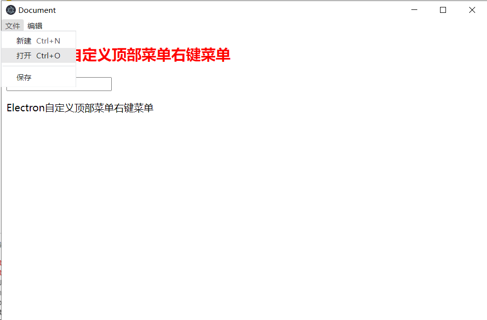

## 自定义菜单

### 在主进程中定义`自定义菜单`

`ipcMain/menu.js`

```javascript
const { Menu } = require("electron");

//https://www.electronjs.org/docs/api/menu-item
var menuTemplate = [
    {
        label:"文件",
        // 二级菜单
        submenu:[
            {
                label:"新建",
                // 快捷键
                accelerator:"ctrl+n",
                // 点击事件
                click:()=>{
                    console.log("Ctrl+N")
                }
            },
            {
                label:"打开",
                accelerator:"ctrl+o",
                click:()=>{
                    console.log("Ctrl+O")
                }
            },
            {
                // 分割线
                type:"separator"
            },
            {
                label:"保存"
            }
        ]
    },
    {
        label:"编辑",
        submenu:[
            {
                label:"复制",
                // 角色（ ctrl+c 是系统默认的，故使用角色来代替）
                role:"copy",
                click:()=>{
                    console.log("copy")
                }
            },
            {
                label:"黏贴",
                role:"paste"
            }            
        ]
    }
];

var menuBuilder=Menu.buildFromTemplate(menuTemplate);

Menu.setApplicationMenu(menuBuilder);
```

`main.js`

```javascript
const createWindow = () => {      
    //引入menu渲染进程
    require('./ipcMain/menu');
}
```



### 点击自定义菜单，主进程给渲染进程发送消息

```javascript
// ipcMain/menu.js
const { Menu,BrowserWindow } = require("electron");


var menuTemplate = [
    {
        label:"文件",
        submenu:[
            {
                label:"触发渲染进程里面的方法",               
                click:()=>{
                    BrowserWindow.getFocusedWindow().webContents.send("rendererMsg","触发渲染进程里面的方法--我是主进程")
                }
            },
        ]
    },
];

var menuBuilder = Menu.buildFromTemplate(menuTemplate);

Menu.setApplicationMenu(menuBuilder);
```

渲染进程接收

```javascript
ipcRenderer.on("rendererMsg",(e,data)=>{
    console.log(data) // 触发渲染进程里面的方法--我是主进程
 })
```

