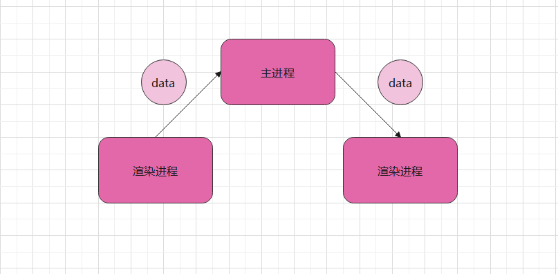

## 渲染进程间的通信

常规：渲染进程间的通信必须借助主进程，才能实现渲染进程间的通信



> 也可以：使用  localStorage 将信息存入到浏览器中，在新窗口中，在通过  localStorage 获取

### 场景一：父窗口传递消息到子窗口

首页

```html
<!DOCTYPE html>
<html>
<head></head>
<body>
   <button id="btn">打开新窗口</button>
   <script src="./ipcRenderer/index.js"></script>
</body>
</html>
```

触发 `打开新窗口`事件给主进程发送消息

```javascript
// ipcRenderer/index.js
const { ipcRenderer } = require("electron");
window.onload = () => {
    var btnDom = document.querySelector("#btn");
    btnDom.onclick = () => {
        ipcRenderer.send("openNews",{data: "渲染进程传递给新渲染进程的消息"})
    }
}
```

主进程接收消息，并创建窗口及传递信息

```javascript
const { BrowserWindow,ipcMain} = require("electron");
const path = require("path");

ipcMain.on("openNews",(event,data)=>{
    console.log(data) // {data: "渲染进程传递给新渲染进程的消息"}
    const newsWindow = new BrowserWindow({
        width: 400,
        height: 300,
    });
    // 加载新窗口
    newsWindow.loadFile(path.join(__dirname, "../news.html"));
    // 监听新窗口加载完毕
    newsWindow.webContents.on('did-finish-load',(event) => { 
        // 传递消息给新窗口
        newsWindow.webContents.send("toNews",data);
    })

})
```

新窗口`news.html`接收消息

```html
<!DOCTYPE html>
<html >
<head></head>
<body>
    <h2>news 页面</h2>
    <script src="./ipcRenderer/news.js"></script>
</body>
</html>
```

```javascript
// ipcRenderer/news.js
const { ipcRenderer } = require("electron");
ipcRenderer.on("toNews",(e,data)=>{
    console.log(data); // {data: "渲染进程传递给新渲染进程的消息"}
})
```

### 场景二：子窗口传递消息给父窗口

同理：

```javascript
// ipcRenderer/news.js
var btnDom = document.querySelector("#btn");
btnDom.onclick = () => {
    ipcRenderer.send("runIndexFn","this is news html")
}
```

```javascript
// 主进程
ipcMain.on("runIndexFn",(e,data)=>{
    console.log(data)
    console.log(indexId)
    //获取index对应的BrowserWindow
    let mainWin = BrowserWindow.fromId(indexId);
    mainWin.webContents.send("toIndex",data)
})
```

indexId 是在创建子窗口`new.html`时,保存下来的 id

```javascript
indexId = BrowserWindow.getFocusedWindow().id;
```

```javascript
//接收主进程传过来的值   主进程里面的数据来源于news这个渲染进程
ipcRenderer.on("toIndex",(event,data) => {
    console.log(data)
})
```

