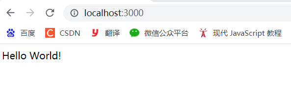
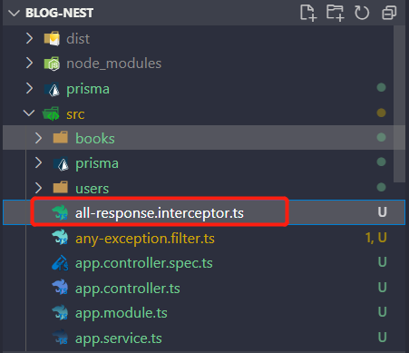

## 使用 NEXT 搭建后台服务接口

https://docs.nestjs.com/

https://www.bilibili.com/video/BV1VF411i7qk?p=4&spm_id_from=pageDriver

### # 准备工作

* 安装 node

* 全局安装 nest 

  * `npm i -给@nestjs/cli`

  * `nest --version` 

<hr/>

###  # 创建项目

* 创建项目`next new`


* 启动项目`npm run start` 或 `npm run start:dev`


* 访问接口 `localhost:3000`



* 获取命令解释 `next g -h`


<hr/>

###  # 快速创建 RESTAPI 入口文件

* 进入项目根目录下，执行命令 `nest g res books --no-spec`


注意：--no-spec 不生成单元测试文件

也可以进行全局配置

在`nest-cli.json` 添加以下代码即可

```json
"generateOptions": {
    "spec": false
 }
```


<hr/>

###  # 配置生成接口文档

* `npm install --save @nestjs/swagger`

修改项目 main.ts 配置文件增加以下代码

```typescript
import { NestFactory } from '@nestjs/core';
import { SwaggerModule, DocumentBuilder } from '@nestjs/swagger';
import { AppModule } from './app.module';

async function bootstrap() {
  const app = await NestFactory.create(AppModule);

  const config = new DocumentBuilder()
    .setTitle('接口文档')
    .setDescription('这个接口文档我是自动生成的')
    .setVersion('1.0')
    .addTag('blog')
    .build();
  const document = SwaggerModule.createDocument(app, config);
  SwaggerModule.setup('api', app, document);

  await app.listen(3000);
}
bootstrap();
```

* 启动项目


* 进行接口测试


<hr>

###  # 设置请求方式及其获取参数

```typescript
// books.controller.ts
import {
  Controller,
  Get,
  Post,
  Body,
  Patch,
  Param,
  Delete,
} from '@nestjs/common';
import { BooksService } from './books.service';
import { CreateBookDto } from './dto/create-book.dto';
import { UpdateBookDto } from './dto/update-book.dto';

@Controller('books')
export class BooksController {
  constructor(private readonly booksService: BooksService) {}

  @Post()
  create(@Body() createBookDto: CreateBookDto) {
    // 创建 book 数据
    return this.booksService.create(createBookDto);
  }

  @Get('/findAll')
  findAll() {
    // 获取所有 book 数据
    return this.booksService.findAll();
  }

  @Get(':id')
  findOne(@Param('id') id: string) {
    // 查找指定 id 的 book
    return this.booksService.findOne(id);
  }

  @Patch(':id')
  update(@Param('id') id: string, @Body() updateBookDto: UpdateBookDto) {
    // 更新指定 id 的 book
    return this.booksService.update(id, updateBookDto);
  }

  @Delete(':id')
  remove(@Param('id') id: string) {
    // 删除指定 id 的 book
    return this.booksService.remove(id);
  }
}
```

<hr>

###  # 对接数据库

####  使用 prisma 对接数据库

步骤一：安装 prisma `npm install prisma --save-dev`

步骤二：初始化 prisma `npx prisma init`


在 vsCode 中打开 schema.prisma 需要下载 prisma 插件


步骤三：在 `schema.prisma`  初始化数据表

```typescript
generator client {
  provider = "prisma-client-js"
}

datasource db {
  provider = "sqlite"
  url      = env("DATABASE_URL")
}

// 用户表
model user {
  // id 为主键
  id String @id @unique @default(uuid())
  userName String @unique @map("user_name")
  // 默认值为 ""  
  password String @default("")
  nickName String @default("") @map("nick_name")
  createdAt DateTime @default(now()) @map("created_at")
  updateAt DateTime @updatedAt @map("updated_at")

  @@map("users") // 给表其别名
}

// 书籍表
model book {
  id String @id @unique @default(uuid())
  title String @default("")
  author String @default("")
  price Float @default(0)

  @@map("books")
}
```

步骤四：生成数据库`npx prisma db push`


步骤五：创建 prisma 的服务

`npx prisma init --datasource-provider sqlite`

会在 src 目录下生成 prisma 文件


并且在要使用数据库连接的RESTAPI模块中进行注册

```typescript
// books.module.ts
import { Module } from '@nestjs/common';
import { BooksService } from './books.service';
import { BooksController } from './books.controller';
import { PrismaService } from 'src/prisma/prisma.service';

@Module({
  controllers: [BooksController],
  providers: [BooksService, PrismaService],
})
export class BooksModule {}
```

步骤六：在 vscode 中打开数据库

（1）在 vscode 中 下载 sqlite


（2） 打开命令面板（Ctrl + Shift + P）


此时在 vscode 的左侧可以看到数据库中的两张表


####  使用prisma对数据进行增删查改

```typescript
// books.service.ts
import { Injectable } from '@nestjs/common';
import { CreateBookDto } from './dto/create-book.dto';
import { UpdateBookDto } from './dto/update-book.dto';
import { PrismaService } from 'src/prisma/prisma.service';
@Injectable()
export class BooksService {
  // 创建 只读 的 prismaService 实体类  
  constructor(private readonly prismaService: PrismaService) {}
  
  // 创建 book 数据
  create(createBookDto: CreateBookDto) {
    return this.prismaService.book.create({
      data: createBookDto,
    });
  }
    
  // 获取所有 book 数据
  findAll() {
    return this.prismaService.book.findMany({ where: {} });
  }
    
  // 查找指定 id 的 book
  findOne(id: string) {
    return this.prismaService.book.findUnique({
      where: {
        id,
      },
    });
  }
  
  // 更新指定 id 的 book  
  update(id: string, updateBookDto: UpdateBookDto) {
    return this.prismaService.book.update({
      where: {
        id,
      },
      data: updateBookDto,
    });
  }
  
  // 删除指定 id 的 book  
  remove(id: string) {
    return this.prismaService.book.delete({
      where: {
        id,
      },
    });
  }
}
```

> create-book.dto 与 update-book.dto 解释
>
> 这两个文件都是用于存放 book 在 创建数据 以及 更新数据 时，数据的类型。
>
> 类似于 Java 中的实体类
>
> 好处在于：可以更好的对数据进行管理，并且当用户传入不合法的数据结构时， nest 可以对此做出处理，后面会具体涉及

```typescript
// create-book.dto
export class CreateBookDto {
  title: string;
  author: string;
  price: number;
}
```

<hr>

### # 对数据格式进行处理


这里使用第一种方式：` npm i --save class-validator class-transformer`，并在 main.ts 进行注册

```typescript
import { ValidationPipe } from '@nestjs/common';
async function bootstrap() {
    const app = await NestFactory.create(AppModule);
    app.useGlobalPipes(new ValidationPipe());
    await app.listen(3000);
}
bootstrap();
```

回到 create-book.dto

```typescript
import { ApiProperty } from '@nestjs/swagger';
import { IsNotEmpty, IsString } from 'class-validator';

export class CreateBookDto {
  @ApiProperty({
    name: 'title',
    description: '书名',
  })   
  @IsNotEmpty({ message: '书名不能为空' })
  title: string;

  @ApiProperty({
    name: 'author',
    description: '作者',
  })
  @IsString({ message: '必须为字符串' })  
  author: string;

  @ApiProperty({
    name: 'price',
    description: '价格',
  })
  price: number;
}
```

> 补充： @ApiProperty 是在生成接口文档对实体类中的每个字段进行描述


<hr/>

###  #  统一返回数据格式

* `nest g itc all-response --no-spec`



同样需要在 main.ts 进行注册

```typescript
import { AllResponseInterceptor } from './all-response.interceptor';
async function bootstrap() {
    const app = await NestFactory.create(AppModule);
    app.useGlobalInterceptors(new AllResponseInterceptor());
    await app.listen(3000);
}
bootstrap();
```

接着在 `all-response.interceptor` 对数据进行格式处理

```typescript
import {
  CallHandler,
  ExecutionContext,
  Injectable,
  NestInterceptor,
} from '@nestjs/common';
import { Observable, map } from 'rxjs';

@Injectable()
export class AllResponseInterceptor implements NestInterceptor {
  intercept(context: ExecutionContext, next: CallHandler): Observable<any> {
    return next.handle().pipe(
      map((data) => {
        return {
          data,
          success: true,
          errorMessage: '',
        };
      }),
    );
  }
}
```


<hr/>

### # 异常处理

* `nest g f any-exception --no-spec` 


同样需要在 main.ts 进行注册

```typescript
import { AnyExceptionFilter } from './any-exception.filter';
async function bootstrap() {
    const app = await NestFactory.create(AppModule);
     app.useGlobalFilters(new AnyExceptionFilter());
    await app.listen(3000);
}
bootstrap();
```

接着在 `any-exception.filter` 对异常进行处理

```typescript
import {
  ArgumentsHost,
  Catch,
  ExceptionFilter,
  HttpException,
  HttpStatus,
} from '@nestjs/common';

@Catch()
export class AnyExceptionFilter<T> implements ExceptionFilter {
  catch(exception: any, host: ArgumentsHost) {
    const ctx = host.switchToHttp();
    const response = ctx.getResponse();
    const request = ctx.getRequest();
    const status = exception instanceof HttpException ? exception.getStatus() : HttpStatus.INTERNAL_SERVER_ERROR;
    response.status(status).json({
      statusCode: status,
      timestamp: new Date().toISOString(),
      path: request.url,
      // errorMessage: exception?.message,
      data: {},
      success: false,
    });
  }
}
```

<hr/>

### # 中间键

* nest g mi validate-login --no-spec

* npm i cookie-parser

```typescript
// validate-login.middleware
import {
  Injectable,
  NestMiddleware,
  UnauthorizedException,
} from '@nestjs/common';

@Injectable()
export class ValidateLoginMiddleware implements NestMiddleware {
  use(req: any, res: any, next: () => void) {
    if (req.cookies.token) {
      next();
    } else {
      throw new UnauthorizedException();
    }
    next();
  }
}
```

在 App.module.ts 进行拦截注册

```typescript
import { ValidateLoginMiddleware } from './validate-login.middleware';
export class AppModule implements NestModule {
  configure(consumer: MiddlewareConsumer) {
    consumer.apply(ValidateLoginMiddleware).forRoutes(...['move']);
  }
}
```

