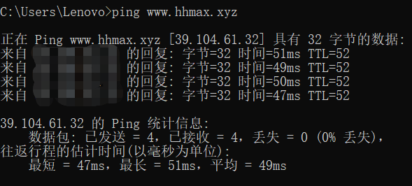
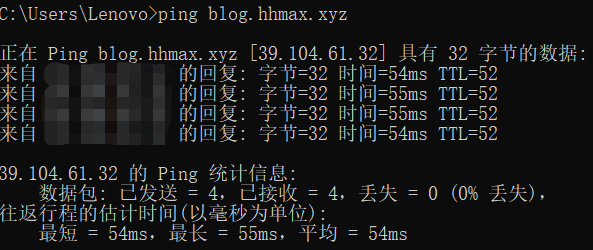
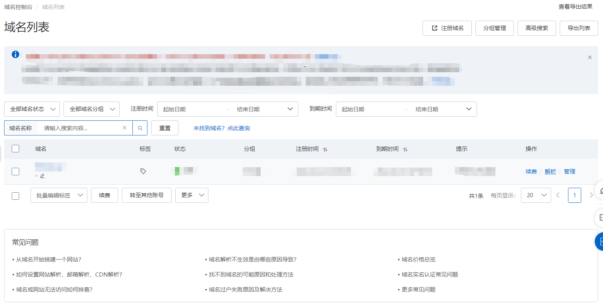
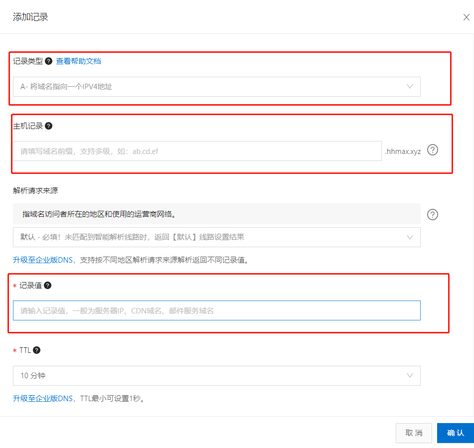
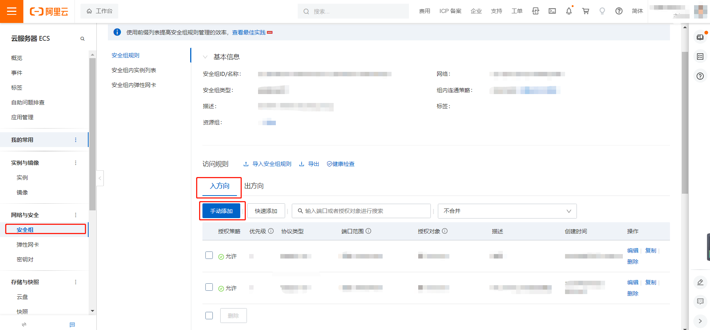
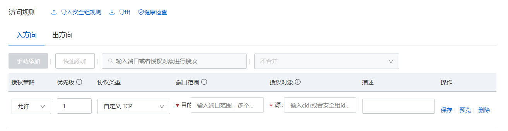
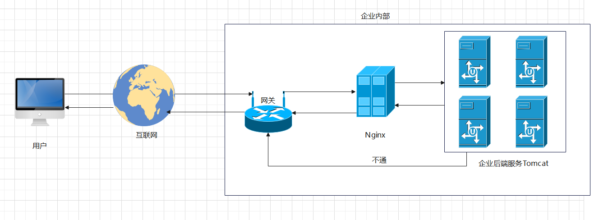

##  最小单元配置

```nginx
worker_processes 1; # 工作的进程个数

events {
    worker_connections 1024; # 一个进程可以创建多少个链接（默认 1024）
}

http {
    # 引入其他配置（返回前端的头部信息，告诉浏览器返回的数据格式）
    include mime.types; 
    # 如果没有命中 mime.types 的类型，则默认返回 application/octet-stream 的数据格式
    default_type application/octet-stream;
    # 数据零拷贝 （减少了 nginx 读取文件，拷贝文件，直接将文件返回给到前端）
    sendfile on;
    # 保存连接超时时间
    keepalive_timeout 65;
    
    # 虚拟主机
    server {
        # 监听端口
        listen 80;
        # 域名、主机名
        server_name localhost;
        
        location / { # / 转发
            # 指向 nginx 目录下的 html 目录
            root html;
            # 默认展示页
            index index.html index.htm
        }
        
        # 错误码为 500 502 503 504 会命中 50x.html
        error_page 500 502 503 504 /50x.html
        # 访问 /50x.html 会被代理到 nginx 下的 html 目录下  
        location = /50x.html {
          root html
        }
    }
}
```

<hr/>

## 二级域名转发

> 根据不同的二级域名返回不同的站点
>
> 如：
>
> * 域名 blog.hhmax.xyz 返回博客站点
> * 域名 www.hhmax.xyz 返回主站站点

原理：将不同的二级域名都指向同一个 IP 地址，在通过 Nginx 在转发时，根据不同的二级域名，返回不同的站点

下面通过俩种方式进行演示：

### 内网模拟站点映射

在 `C:\Windows\System32\drivers\etc\hosts` 文件中添加

```
39.104.61.35 blog.hhmax.xyz
39.104.61.35 www.hhmax.xyz
```

测试是否映射成功

```cmake
ping blog.hhmax.xyz
```



```
ping www.hhmax.xyz
```


接下来进行 Nginx 配置，配置内容如下：

```nginx
http {
  include mime.types; 
  default_type application/octet-stream;
  sendfile on;
  keepalive_timeout 65;  
  server {
     listen: 80,
     server_name www.hhmax.xyz;  
     location / {
        root html; # 转发到 nginx/html/index.html 或 index.htm
        index index.html index.htm
     }   
  },
  server {
     listen: 80,
     server_name blog.hhmax.xyz;  
     location / {
        root blog; # 转发到 nginx/blog/index.html 或 index.htm
        index index.html index.htm
     }   
  }       
}
```

<hr/>

### 外网模拟站点映射

> 需要购买域名以及一台服务器，并且服务器要备案成功才能映射成功



选中域名解析，并添加记录



需要设置的字段

* 记录类型：这里选择 A - 将域名指向一个 IPV4 的地址
* 主机记录：可以填写一个二级域名（即我们要设置的 blog 和 www）
* 记录值：映射的地址（即我们要映射的服务器IP地址）
> 可添加多条记录，并映射到其他 IP 或相同 IP

接下来进行 Nginx 配置，配置内容如下：

```nginx
http {
  include mime.types; 
  default_type application/octet-stream;
  sendfile on;
  keepalive_timeout 65;  
  server {
     listen: 80,
     server_name www.hhmax.xyz;  
     location / {
        root html; # 转发到 nginx/html/index.html 或 index.htm
        index index.html index.htm
     }   
  },
  server {
     listen: 80,
     server_name blog.hhmax.xyz;  
     location / {
        root blog; # 转发到 nginx/blog/index.html 或 index.htm
        index index.html index.htm
     }   
  }       
}
```

**注意：上述 Nginx 配置监听的端口是 80 端口，服务器可能需要开启**





<hr/>

## 反向代理

### 正向代理

概念：


### 反向代理

概念：



Nginx 与 Tomcat 形成内网，Tomcat 不能直接绕过 Nginx 通过网关，发送消息。必须通过 Nginx 来发送消息。这种模式称为 **隧道式代理**

由此，也暴露出一个问题，当数据量很大时，尽管 Tomcat 的带宽有 100M，但 Nginx 的带宽只有 10 M。由于需要借助 Nginx 来向外传递数据，最终的传输数据没有设想的那么好。**Tomcat 带宽再好，也要受限于 Nginx**。

为了解决上述的缺点：

衍生出一种模式： **Nginx 只处理进来的请求，而出去的数据不经过 Nginx 进行转发。Tomcat 直接将数据通过网关发送给到用户**（中间会经过其他网关进行转发）。这种模式称为 **DR 模式**

### 反向代理配置

```nginx
http {
  include mime.types; 
  default_type application/octet-stream;
  sendfile on;
  keepalive_timeout 65;  
  server {
     listen: 80,
     server_name blog.hhmax.xyz;  
     location / {
       # 当访问 blog.hhmax.xyz 是代理到 http://www.baidu.com    
       proxy_pass http://www.baidu.com
     } 
     location /api { # 笔记
        # 当访问 blog.hhmax.xyz/api 是代理到 内网中的 http://127.0.0.1:3200    
        proxy_pass http://127.0.0.1:3200;
     }   
  }       
}
```

**注意：上述例子中代理到后端服务 3200 端口也需要开放**


<hr/>

## 负载均衡

概念：

### 普通轮询

```nginx
http {
  include mime.types; 
  default_type application/octet-stream;
  sendfile on;
  keepalive_timeout 65;  
  
  # 轮询的服务器  
  upstream httpds {
     server 192.168.5.51:80;   
     server 192.168.6.51:80; 
     server 192.168.7.51:80; 
  }
    
  server {
     listen: 80,
     server_name blog.hhmax.xyz;  
     location / {
       proxy_pass http://httpds;
     }   
  }       
}
```

`192.168.5.51:80`、`192.168.6.51:80`、`192.168.7.51:80` 三台服务器提供的服务都一样。

### 权重轮询

```nginx
http {
  include mime.types; 
  default_type application/octet-stream;
  sendfile on;
  keepalive_timeout 65;  
  
  # 权重值越大，被轮询到的可能性越大
  upstream httpds {
     server 192.168.5.51:80 weight=8;   
     server 192.168.5.51:80 weight=1; 
     server 192.168.5.51:80 weight=7; 
  }
  server {
     listen: 80,
     server_name blog.hhmax.xyz;  
     location / {
       proxy_pass http://httpds;
     }   
  }       
}
```

> 另外一些配置
>
> *  down （若配置，则该台服务器不参与轮询）
> * backup（若配置，则该台服务器为备用机，当其他轮询服务器不能使用时，才会使用该服务器）
>
> 具体使用如下：
>
> ```nginx
> http {
>   include mime.types; 
>   default_type application/octet-stream;
>   sendfile on;
>   keepalive_timeout 65;  
> 
>   upstream httpds {
>      server 192.168.5.51:80 weight=8 down;   
>      server 192.168.5.51:80 weight=1; 
>      server 192.168.5.51:80 weight=7 backup; 
>   }
>   server {
>      listen: 80,
>      server_name blog.hhmax.xyz;  
>      location / {
>        proxy_pass http://httpds;
>      }   
>   }       
> }
> ```

### 缺点

由于是轮询，所以导致**没法保存会话信息**，如在 `192.168.5.51:80` 用户登录成功。当用户再次访问该站点时，被 Nginx 轮询到`192.168.7.51:80` ，此时这台服务器是不知道用户已经登录了，所以需要重新在登录。

随着技术的发展，为了解决轮询带来的会话信息无法保存，衍生出了两种方案来解决上述问题

* 其一：借助 cookie、session、redis


* 其二：无状态的会话通信 （JWT）


<hr/>

## 动静分离

在还没有前后端分离的开发模式的情况下（MVC），一些静态资源都是集中和后端代码放在 Tomcat 。而这些静态资源大多数情况下都是不变的，如：图片，JavaScript 代码。

因此，可以将一些静态资源放到 Nginx 中，从而使一些静态资源与业务逻辑进行抽离。

具体配置如下：

```nginx

```

随着技术的发展，特别是前后端分离的开发模式，上述情况也不复存在，后端也不用考虑到静态资源该怎么处理，都转移给到前端了
