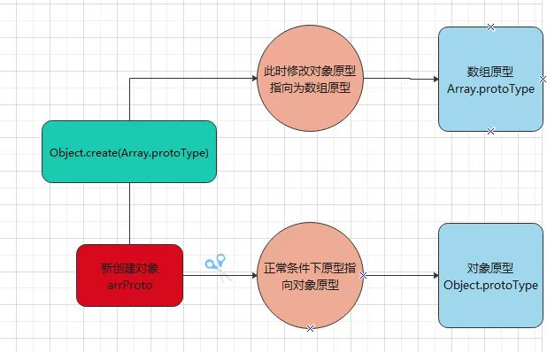

### 双向数据绑定

### vue2 双向数据绑定

1、视图

```javascript
function updateView() {
    console.log("更新视图");
}
```

2、绑定对象监听

```javascript
// 绑定对象监听
function defineReactive(target, key, val) {
    // 深度监听 (值嵌套对象)
    observer(val);
    
    Object.defineProperty(target, key, {
        get() {
            return val;
        },
        set(newVal) {
            if (newVal != val) {
                // 关键点1
                observer(newVal); 

                val = newVal;

                // 更新视图
                updateView();
            }
        }
    })
}
```

代码解释：

（1）关键点1：深度监听（避免重新设置值为对象，导致新的值无法监听到）**一次性全部递归监听**

3、绑定数组监听

```javascript
// 绑定数组监听
const arrProto = Object.create(Array.prototype);
// 将数组方法复写挂载到新对象中
['push', 'pop', 'shift', 'unshift', 'splice'].forEach(methodName => {
    arrProto[methodName] = function() {
        // 更新视图
        updateView();
        // 执行原型链的方法
        oldArrayProperty[methodName].call(this, ...arguments);
    }
})
```

> `arrProto = Object.create(oldArrayProperty)`：创建新对象，并且该对象的原型指向数组原型 `Array.prototype` （ 目的：在新对象上拓展方法，不会影响原型对象）



4、observer

```javascript
function observer(target) {
    if (typeof target !== 'object' || target == null) {
        return target;
    }

    // 数组
    if (Array.isArray(target)) {
        // 修改数组原型指向
        target.__proto__ = arrProto;
    }

    for (let key in target) {
        defineReactive(target, key, target[key]);
    }
}
```

5、使用

```javascript
const data = {
    name: "haohao",
    age: 20,
    info: {
        sex: "男",
    },
    test: "",
    nums: [1, 2, 3]
}

// 双向绑定
observer(data);
```

6、测试

* 监听基本属性

  ```javascript
  data.name = 'lisi';
  console.log(data.name);
  ```

* 深度监听

  ```javascript
  data.info.sex = '女';
  console.log(data.info.sex);
  ```

* 监听设置值（引用类型是否还能监听到）

  ```javascript
  data.test = {
     a: 1
  }
  data.test.a = 2;
  console.log(data.test.a);
  ```

* 监听数组

  ```javascript
  data.nums.push(6);
  ```

* 新增属性（监听不到 -- Vue.$set）

  ```javascript
  data.x = 123;
  console.log(data.x);
  ```

* 删除属性 （监听不到 -- Vue.$delete）

  ```javascript
  delete data.name;
  ```

7、完整代码

```javascript

function updateView() {
    console.log("更新视图");
}

// 绑定对象监听
function defineReactive(target, key, val) {
    // 深度监听 (值嵌套对象)
    observer(val);
    
    Object.defineProperty(target, key, {
        get() {
            return val;
        },
        set(newVal) {
            if (newVal != val) {
                // 深度监听（避免重新设置值为对象，导致新的值无法监听到）
                observer(newVal);

                val = newVal;

                // 更新视图
                updateView();
            }
        }
    })
}

// 绑定数组监听
const oldArrayProperty = Array.prototype;
// 创建新对象，并且该对象的原型指向数组原型Array.prototype （目的：在新对象上拓展方法，不会影响原型对象）
const arrProto = Object.create(oldArrayProperty);
// 将数组方法复写挂载到新对象中
['push', 'pop', 'shift', 'unshift', 'splice'].forEach(methodName => {
    arrProto[methodName] = function() {
        // 更新视图
        updateView();
        // 执行原型链的方法
        oldArrayProperty[methodName].call(this, ...arguments);
    }
})

const data = {
    name: "haohao",
    age: 20,
    info: {
        sex: "男",
    },
    test: "",
    nums: [1, 2, 3]
}

// 双向绑定
observer(data);


function observer(target) {
    if (typeof target !== 'object' || target == null) {
        return target;
    }

    // 数组
    if (Array.isArray(target)) {
        // 修改数组原型指向
        target.__proto__ = arrProto;
    }

    for (let key in target) {
        defineReactive(target, key, target[key]);
    }
}

// // 监听基本属性
// data.name = 'lisi';
// console.log(data.name);

// // 深度监听
// data.info.sex = '女';
// console.log(data.info.sex);

// // 监听设置值（引用类型是否还能监听到）
// data.test = {
//     a: 1
// }
// data.test.a = 2;
// console.log(data.test.a);

// // 监听数组
// data.nums.push(6);

// // 新增属性（监听不到 -- Vue.$set）
// data.x = 123;
// console.log(data.x);

// // 删除属性 （监听不到 -- Vue.$delete）
// delete data.name;
```

<hr/>

### vue3双向数据绑定

1、使用 Proxy 进行代理

```javascript
function reactive(target = {}) {
    if (typeof target !== 'object' || target == null) {
        return target;
    }

    // 代理
    const proxyConf = {
        get(target, key, receiver) {
            // 只处理本身（非原型）属性 关键点1
            const ownKeys = Reflect.ownKeys(target);
            if (ownKeys.includes(key)) {
                console.log("获取 get：", key)
            }

            const result = Reflect.get(target, key, receiver);

            // 关键点2
            return reactive(result);
        },

        set(target, key, val, receiver) {
            // 重复数据（不处理）
            if (val == target[key]) return true;

            const ownKeys = Reflect.ownKeys(target);
            if (ownKeys.includes(key)) {
                console.log("设置 key：", key, "val：", val);
            } else {
                console.log("新增 key：", "key", "val：", val);
            }

            const result = Reflect.set(target, key, val, receiver);
            return result; // 是否设置成功
        },

        deleteProperty(target, key) {
            const result = Reflect.deleteProperty(target, key);
            console.log("删除 key：", key);
            return result; // 是否删除成功
        }
    }

    const proxyData = new Proxy(target, proxyConf);
    return proxyData;
}
```

代码解释：

（1）关键点1：通过 `Reflect.ownKeys(target)`获取 target 本身具备的属性，监听属于 target 自身属性

（2）关键点2：返回的对象必须是`Proxy`对象，目的在于确保能够实时监听该对象下的属性

vue3 关键点1对比 vue2 关键点1：

（1）vue2：是一次性全部递归监听

（2）vue3：是分多次进行监听（只要访问对象属性，则会监听属性下的所有属性，没有返回到的就不会进行监听）

2、使用

```javascript
const data = {
    name: 'haohao',
    age: 20,
    info: {
        city: 'shangtou',
        a: {
            b: {
                c: {
                    d: {
                        e: 100
                    }
                }
            }
        }
    },
    test: "",
    nums: [1, 2, 3, 4]
}
```

3、测试

* 监听基本属性

  ```javascript
  proxyData.name = 'lisi'; 
  // 设置 key： name val： lisi
  ```

* 深度监听

  ```javascript
  proxyData.info.city = '汕头'; 
  // 获取 get： info
  // 设置 key： city val： 汕头
  ```

* 监听设置值（引用类型是否还能监听到）

  ```javascript
  proxyData.test = { a: 1 } 
  // 设置 key： test val： { a: 1 }
  ```

  ```javascript
  proxyData.test.a = 2;
  // 获取 get： test
  // 设置 key： a val： 2
  ```

* 监听数组

  ```javascript
  proxyData.nums.push(6);
  // 获取 get： nums
  // 获取 get： length
  // 新增 key： key val： 6
  ```

* 新增属性

  ```javascript
  proxyData.x = 123; 
  // 新增 key： key val： 123
  ```

* 删除属性

  ```javascript
  delete proxyData.name; 
  // 删除 key： name
  ```

4、完整代码

```javascript
function reactive(target = {}) {
    if (typeof target !== 'object' || target == null) {
        return target;
    }

    // 代理
    const proxyConf = {
        get(target, key, receiver) {
            // 只处理本身（非原型）属性
            const ownKeys = Reflect.ownKeys(target);
            if (ownKeys.includes(key)) {
                console.log("获取 get：", key)
            }

            const result = Reflect.get(target, key, receiver);

            // 关键点
            return reactive(result);
        },

        set(target, key, val, receiver) {
            // 重复数据（不处理）
            if (val == target[key]) return true;

            const ownKeys = Reflect.ownKeys(target);
            if (ownKeys.includes(key)) {
                console.log("设置 key：", key, "val：", val);
            } else {
                console.log("新增 key：", "key", "val：", val);
            }

            const result = Reflect.set(target, key, val, receiver);
            return result; // 是否设置成功
        },

        deleteProperty(target, key) {
            const result = Reflect.deleteProperty(target, key);
            console.log("删除 key：", key);
            return result; // 是否删除成功
        }
    }

    const proxyData = new Proxy(target, proxyConf);
    return proxyData;
}


const data = {
    name: 'haohao',
    age: 20,
    info: {
        city: 'shangtou',
        a: {
            b: {
                c: {
                    d: {
                        e: 100
                    }
                }
            }
        }
    },
    test: "",
    nums: [1, 2, 3, 4]
}
const proxyData = reactive(data);

// 监听基本属性
// proxyData.name = 'lisi'; 
// 设置 key： name val： lisi

// 深度监听
// proxyData.info.city = '汕头'; 
// 获取 get： info
// 设置 key： city val： 汕头

// 监听设置值（引用类型是否还能监听到）
// proxyData.test = { a: 1 } // 设置 key： test val： { a: 1 }

// proxyData.test.a = 2;
// 获取 get： test
// 设置 key： a val： 2

// 监听数组
// proxyData.nums.push(6);
// 获取 get： nums
// 获取 get： length
// 新增 key： key val： 6

// 新增属性
// proxyData.x = 123; 
// 新增 key： key val： 123

// 删除属性
// delete proxyData.name; // 删除 key： name
```

<hr/>

### 总结

vue3 优缺点：

* 深度监听性能更好
* 可监听 新增 / 删除 属性
* 可监听数组变化
* Proxy 能规避 Object.defineProxy 的问题
* Proxy 无法兼容所有浏览器，无法 polyfill

vue2 优缺点：

* 可以兼容其他浏览器
* 深度监听需要一次性递归
* 无法监听 新增 \ 删除 属性
* 无法原生监听数组，需要特殊处理