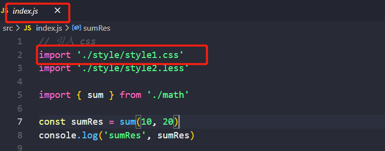
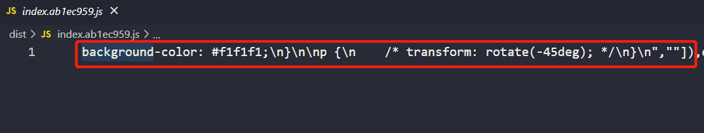
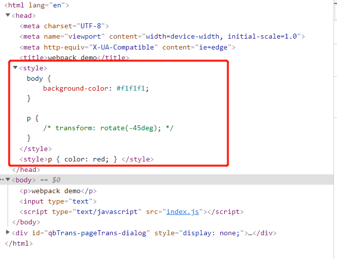
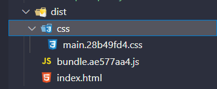
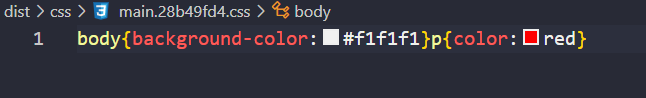
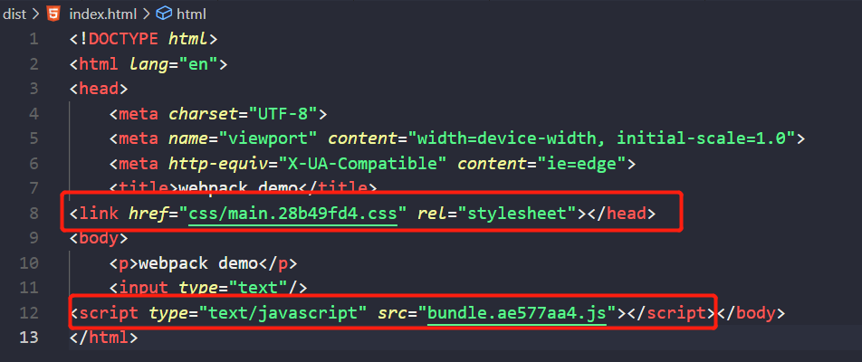

## webpack 和 babel

### 概叙

1、基本配置

2、高级配置

3、性能优化（重点）

* 优化打包效率
* 优化产出代码

4、构建流程概叙

5、babel

<hr/>

### Webpack 基本配置

下面例子涉及的内容：

* 拆分配置及merge

* 启动本地服务

* 处理ES6

* 处理样式

* 处理图片

例子：

* webpack.common.js 公共配置

  ```javascript
  module.exports = {
      entry: `./src/index.js` // 入口文件
      module: {
        rules: [
          {   // 编译 ES6
              test: /\.js$/, // 验证规则
              loader: ['babel-loader'],
              include: './src' // 需要编译的路径
              exclude: /node_modules/ // 不需要编译的路径
          },
          {   // 编译 css
              test: /\.css$/,
              // loader 的执行顺序是： 从后往前    
              loader: ['style-loader', 'css-loader']
          },
          {
              // css兼容处理
              test: /\.css$/,
              loader: ['style-loader', 'css-loader', 'postcss-loader']    
          },
          {
              // 编译 less （scss 同理）
              test: /\.less$/,
              loader: ['style-loader', 'css-loader', 'less-loader']    
          }
        ]
      },
      plugins:[
          new HtmlWebpackPlugin({
              template: './src/index.html',
              filename: 'index.html'
          })
      ]
  }
  ```
  
  1、编译 ES6 是使用 babel，可以在项目的根目录下创建 `.babelrc`文件，配置编译规则
  
  ```json
  {
      "presets": ["@babel/preset-env"],
      "plugins": []
  }
  ```
  
  > `@babel/preset-env`：包含了常用的 ES6,ES7,ES8常用的语法
  
  2、`postcss-loader`：配置浏览器css兼容性。使用时需要在项目根路径下创建`postcss.config.js`
  
  ```javascript
  module.exports = {
      // 增加从 postcss-loader 插件集合中引入添加css前缀插件
      plugins: [require('autoprefixer')]
  }
  ```
  
  > 需要安装 `autoprefixer`、`postcss-loader`

<br/>

* webpack.dev.js 开发配置

  ```javascript
  const webpackCommonConf = require('./webpack.common.js');
  const { smart } = require('webpack-merge');
  const webpack = require('webpack');
  module.exports = smart(webpackCommonConf, {
     mode: 'development',
     module: {
         rules: [
             {
                 // 开发环境下图片处理：直接引入 图片 url
                 test: /\.(png|jpg|jpeg|gif)$/,
                 use: 'file-loader'
             }
         ]
     },
     plugins: [
         new Webpack.DefinePlugin({
             // 配置 window.ENV = 'development'
             ENV: JSON.stringify('development')
         })
     ],
     devServer: {
         port: 8080, 
         progress: true, // 显示打包的进度
         contentBase: './dist', // 项目根路径
         open: true, // 自动打开浏览器
         compress: true // 自动 gzip 压缩
     }
     proxy: {
       // 将本地 /api/xxx 代理到 localhost:3000/api/xxx
      '/api': 'http://localhost:3000',
       // 将本地 /api2/xxx 代理到 localhost:3000/xxx
      '/api2': {
         target: 'http://localhost:3000',
         pathRewrite: {
             '/api2': ''
         }
       }
     }
  });
  ```

  1、开发环境下启动命令（需要下载 webpack-dev-server）
  
  ```javascript
  "dev": "webpack-dev-server --config build-base-conf/webpack.dev.js",
  ```
  
  2、处理图片：开发环境下使用url，如果在线上环境下使用url，对性能方面是比较不友好的       

<br/>

* webpack.prod.js 生产配置（线上）

  ```javascript
  const webpackCommonConf = require('./webpack.common.js');
  const { smart } = require('webpack-merge');
  module.exports = smart(webpackCommonConf, {
      mode: 'production',
      output: {
          filename: 'bundle.[contentHash:8].js', // 打包代码时，加上 hash 戳
          path: './dist'
      }
      module: {
          rules: [
              {
                  //  生产环境下图片处理：将比较小的图片地址设置为base64
                  test: /\.(png|jpg|jpeg|gif)$/,
                  use: {
                      loader: 'url-loader',
                      options: {
                          // 小于 5kb 的图片用 base64 格式产出
                          // 否则，依然延用 file-loader 的形式，产出 url 格式
                          limit: 5 * 1024,
                          outputPath: '/img1', // 图片打包到 img1 目录下
                      }
                  }
              }
          ]
      },
      plugins: [
          {
              new ClearWebpackPlugin(), // 会默认清除 output.path 文件夹
              new Webpack.DefinePlugin({
                   // window.ENV = 'production'
                   ENV: JSON.stringify('production')
              })
          }
      ]
  })
  ```
  
  1、生产环境下启动命令
  
  ```javascript
  "build": "webpack --config build-base-conf/webpack.prod.js"
  ```
  
  2、生产环境下将小图片转成base64的好处
  
  * 减少 http 请求
  * 性能优化
  
  3、打包代码时，加上 hash 戳的好处
  
  * 什么是hash 戳：根据内容去生产对应的8位字符串。只要内容变了，生产的字符串也会进行变化。
  * 当内容没有变化时，访问页面，请求js文件时，会命中缓存，提高访问速度

> 测试代码：code/1

<hr/>

### Webpack 高级配置

#### 多入口文件

* webpack.common.js

  ```javascript
  const HtmlWebpackPlugin = require('html-webpack-plugin')
  module.exports = {
      entry: { // 入口文件
          index: './src/index.js',
          other: './src/other.js'
      },
      module: {
          rules: []
      },
      plugins: [
          // 多入口 - 生成 index.html
          new HtmlWebpackPlugin({
              template: './src/index.html',
              filename: 'index.html',
              // chunks 表示该页面要引用哪些 chunk （即上面的 index 和 other），默认全部引用
              chunks: ['index']  // 只引用 index.js
          }),
          // 多入口 - 生成 other.html
          new HtmlWebpackPlugin({
              template: './src/other.html',
              filename: 'other.html',
              chunks: ['other']  // 只引用 other.js
          })
      ]
  }
  
  ```

  * webpack.prod.js

  ```javascript
  const webpackCommonConf = require('./webpack.common.js')
  const { smart } = require('webpack-merge')
  module.exports = smart(webpackCommonConf, {
      mode: 'production',
      output: {
          // 输出： name 对应 entry index 及 other
          filename: '[name].[contentHash:8].js',
          path: './dist'
      }
  })
  ```

<hr/>

#### 抽离 CSS 文件

背景：按照 webpack 的基本配置案例中，执行命令`npm run dev` 

在入口文件引入 css 文件：



打包生成后：包含css



最终在页面中：css 会显示在`style标签`中



同理执行命令`npm run build` 也会出现上述情况

> 测试代码：code/1

对于开发环境下，问题不是很大。

但在线上环境下这种方式是不友好的，正确的做法是：**将css抽离出来进行打包压缩体积，再已外链的形式引入**

由于是针对线上环境：故在`webpack.prod.js`进行配置

* webpack.prod.js

  ```javascript
  const webpack = require('webpack')
  const { smart } = require('webpack-merge')
  const { CleanWebpackPlugin } = require('clean-webpack-plugin')
  const MiniCssExtractPlugin = require('mini-css-extract-plugin')
  const TerserJSPlugin = require('terser-webpack-plugin')
  const OptimizeCSSAssetsPlugin = require('optimize-css-assets-webpack-plugin')
  const webpackCommonConf = require('./webpack.common.js')
  
  module.exports = smart(webpackCommonConf, {
      mode: 'production',
      output: {
          filename: 'bundle.[contentHash:8].js',  // 打包代码时，加上 hash 戳
          path: './dist'
      },
      module: {
          rules: [
              // 抽离 css
              {
                  test: /\.css$/,
                  loader: [
                      MiniCssExtractPlugin.loader,  // 注意，这里不再用 style-loader
                      'css-loader',
                      'postcss-loader'
                  ]
              },
              // 抽离 less --> css
              {
                  test: /\.less$/,
                  loader: [
                      MiniCssExtractPlugin.loader,  // 注意，这里不再用 style-loader
                      'css-loader',
                      'less-loader',
                      'postcss-loader'
                  ]
              }
          ]
      },
      plugins: [
          // 抽离 css 文件
          new MiniCssExtractPlugin({
              filename: 'css/main.[contentHash:8].css'
          })
      ],
  
      optimization: {
          // 压缩 css
          minimizer: [new TerserJSPlugin({}), new OptimizeCSSAssetsPlugin({})],
      }
  })
  ```

  `npm run build`

  

  

  

  

  > 测试代码：code/2

<hr/>

### 面试题

1、前端代码为何要进行构建和打包

2、module、chunk、bundle 分别是什么意思，有何区别？

3、loader 和 plugin 的区别？

4、webpack 如何实现懒加载

5、webpack 常见性能优化

* 线上打包生成的js和css命名使用hash戳
* 抽离压缩css文件

6、babel-runtime 和 babel-polyfill 的区别