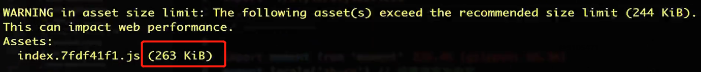
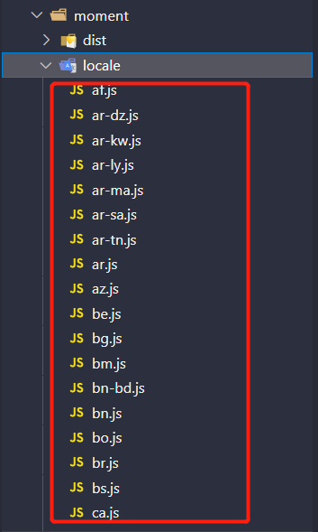

## 如何优化打包构建速度 - 开发体验和效率

### 一、优化 babel-loader

> ES6 语法转 ES5

```javascript
module.exports = {
    module: {
        rules: [
            {
                test: /\.js$/,
                use: ['babel-loader?cacheDirectory'],
                include: ./src/
            }
        ]
    }
} 
```

* ` use: ['babel-loader?cacheDirectory']`：开启缓存
* `include: ./src/`：只编译 src目录下的 js文件

<hr/>

### 二、IgnorePlugin

> 避免引入无用模块

例子：在使用插件**moment **时，默认会引入所有语言编码，会造成浪费。

```javascript
// index.js
import moment from 'moment'
console.log('locale', moment.locale());

console.log(1 + 1);
console.log(1 + 1);
console.log(1 + 1);
console.log(1 + 1);
console.log(1 + 1);
```

 此时在不做如何优化的前提下：执行打包构建



造成上述的原因时，在执行构建时将大量的语言包引入到该入口中，造成体积过大（如下图，只截取部分语言包）



**使用 IgnorePlugin 进行优化**

```javascript
const webpack = require('webpack')
module.export = {
    mode: 'production',
    module: {},
    plugins: [
        // 将 node_modules 中的 moment/locale下的所有语言文件不进行引入
        new webpack.IgnorePlugin(/\.\/locale/, /moment/)
    ]
}
```

```javascript
// index.js
import moment from 'moment'
import 'moment/locale/zh-cn' // 手动引入语言文件
console.log('locale', moment.locale());

console.log(1 + 1);
console.log(1 + 1);
console.log(1 + 1);
console.log(1 + 1);
console.log(1 + 1);
```

执行打包构建：


<hr/>

### 三、 noParse

> 避免重复打包

例子：在一些已经压缩后的文件，我没有不要再去读取该文件，对其进行采用模块化编译。比如：`react.min.js`,`vue.min.js`

```javascript
module.exports = {
    module: {
        noParse: [/react\.min\.js$/],
    }
}
```

<hr/>

### 四、HappyPack

> 多进程打包JS

```javascript
const HappyPack = require('happypack')
module.exports = {
    module: {
        rules: [
            {
                test: /\.js$/,
                // 把对 .js 文件的处理转交给 id 为 babel 的 HappyPack 实例
                use: ['happypack/loader?id=babel'],
                include: srcPath,
            }
        ]
    },
    plugins: [
        // happyPack 开启多进程打包
        new HappyPack({
            // 用唯一的标识符 id 来代表当前的 HappyPack 是用来处理一类特定的文件
            id: 'babel',
            // 如何处理 .js 文件，用法和 Loader 配置中一样
            loaders: ['babel-loader?cacheDirectory']
        }),
    ]
}
```


<hr/>

### 五、ParalleIUglifyPlugin

> 多进程压缩JS

```javascript
const ParallelUglifyPlugin = require('webpack-parallel-uglify-plugin')
module.exports = {
    module: {},
    plugins: [
       // 使用 ParallelUglifyPlugin 并行压缩输出的 JS 代码
        new ParallelUglifyPlugin({
            // 传递给 UglifyJS 的参数
            // （还是使用 UglifyJS 压缩，只不过帮助开启了多进程）
            uglifyJS: {
                output: {
                    beautify: false, // 最紧凑的输出
                    comments: false, // 删除所有的注释
                },
                compress: {
                    // 删除所有的 `console` 语句，可以兼容ie浏览器
                    drop_console: true,
                    // 内嵌定义了但是只用到一次的变量
                    collapse_vars: true,
                    // 提取出出现多次但是没有定义成变量去引用的静态值
                    reduce_vars: true,
                }
            }
        })
    ]
}
```

> 项目较大，打包较慢，开启多进程能提高速度
>
> 项目较小，打包很快，开启多进程会减低速度（进程开销）

<hr/>

### 六、自动刷新

> 自动更新：整个网页全部刷新，速度较慢
>
> 自动刷新：整个网页全部刷新，状态会丢失

```javascript
module.export = {
    watch: true, // 开启监听，默认为 false
    // 注意，开启监听之后，webpack-dev-server 会自动刷新浏览器
    
    // 监听配置
    watchOptions: {
        ignored: /node_modules/, // 忽略哪些
        // 监听到变化发生后，会等 300ms 再去执行动作，避免重新编译频率过快
        aggregateTimeout: 300, // 默认为 300ms,
        // 判断文件是否发生变化是通过不停的去询问系统指定文件有没有变化实现的
        poll:1000 // 默认每隔 1000 毫秒询问一次
    }
}
```

> 在开发环境下，配置 devServer时，默认已经开启自动更新

<hr/>

### 七、热更新

> 热更新：新代码生效，网页不刷新，状态不丢失

<hr/>

### 八、DllPlugin

<hr/>

### 九、总结

可以用于生产环境

* 优化 babel-loader
* IgnorePlugin
* noParse
* HappyPack
* ParalleIUglifyPlugin

不可以用于生产环境

* 自动刷新
* 热更新
* DllPlugin