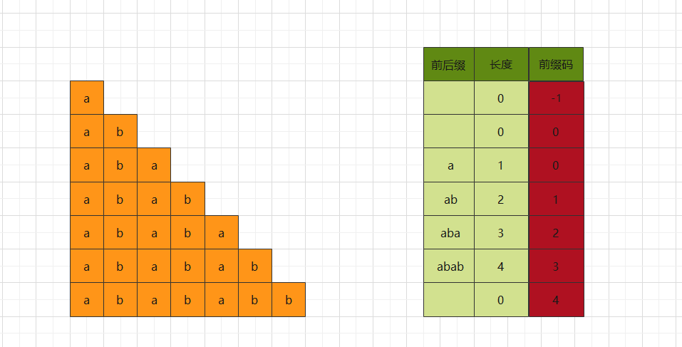
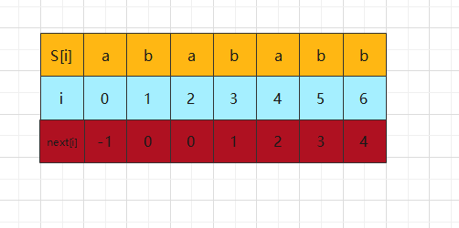
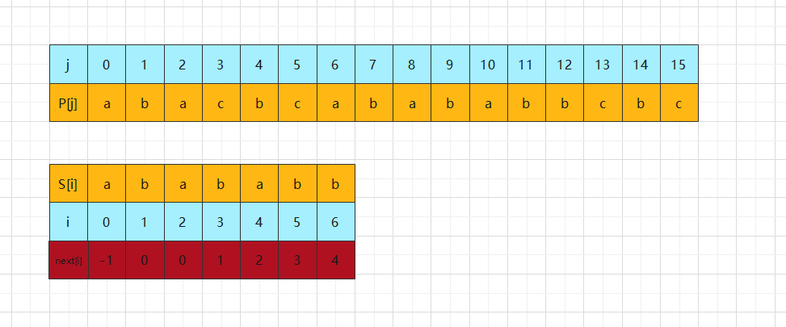
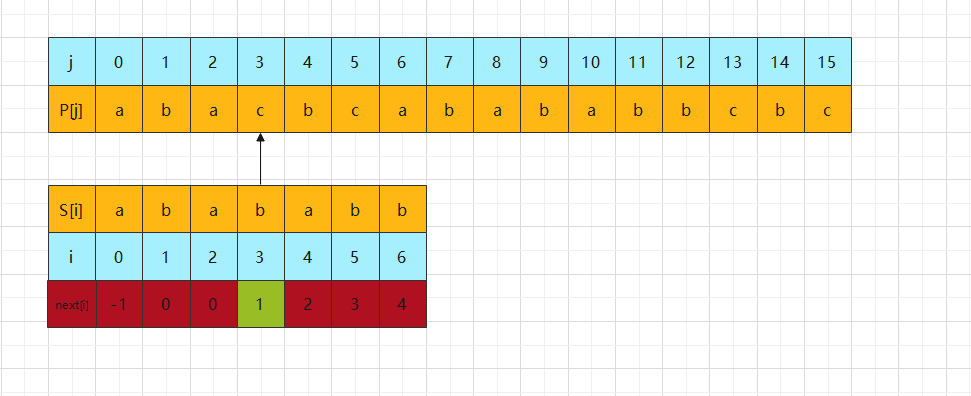
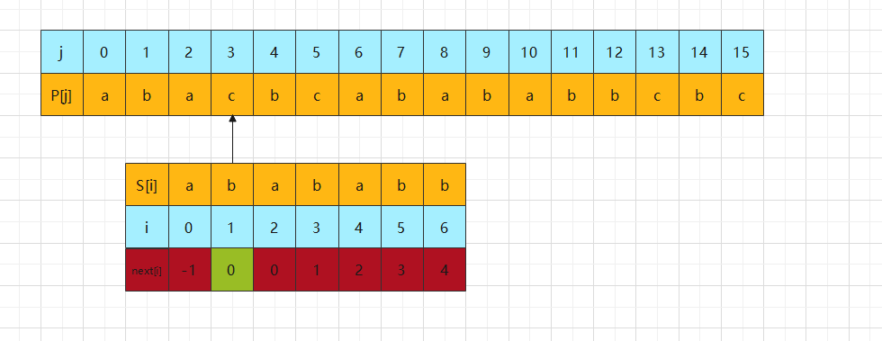
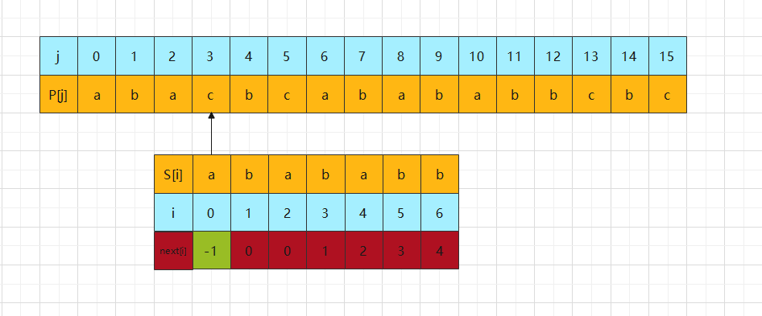
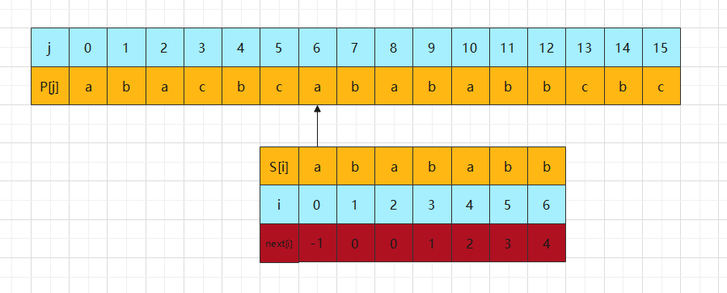
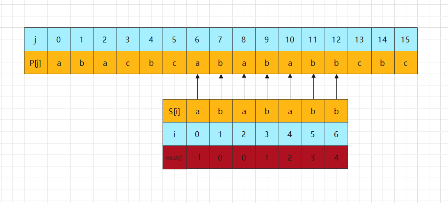

### KMP 算法

主串P： a b a c b c a b a b a b b c b c

模式串S：a b a c b c a

 

第一步：计算模式串S的前缀码

规则: 前后缀码必须一致且是最长，不能超过模式串本身。

 

第二步：列好表格进行匹配，如下：

比较开始：

从模式串S[0] 和主串P[0]，开始匹配，相同。则 i++，j++；直到不匹配。

第一遍匹配到：S[3] 不等于 P[3]

此时找到模式串S[3]对应的next 值为 1，主串匹配位不变，模式串移动到 S[1]（即字符串`b`）

此时还是不等，接着上一步的操作，即 S[0] 和 P[3] 进行比较

这里需要注意的地方是：此时 S[0] 和 P[3] 不等。而对应模式串S位置上的next值为 -1。

到了这一步说明在主串P从开始匹配位置（即0）到结束匹配位置（即3）没有匹配到与模式串一致。

> 换句话说：当匹配到next值为-1时，就结束匹配。

这时，主串 j++ （即 j = 4）与 模式串的开头比较（即S[0]）

此时，S[4] 不等于 S[0]，由于 S[0] 的 next 值（即 -1），故 j++，S[5] 与 P[0] 比较

还是不等，继续重复上一步操作 S[6] 与 P[0] 比较，此时：S[6] 等于 P[0]

i++， j++ 继续比较，比较到 S[12] 等于 P[6]，此时：主串S 从 [6] 到 [12] 都等于 模式串[0] 到 [6]，并且当前模式串匹配位到达上限，因此匹配成功

如果最终结果匹配到主串的上限，并且模式串没有到达上限时，说明主串不存在模式串。