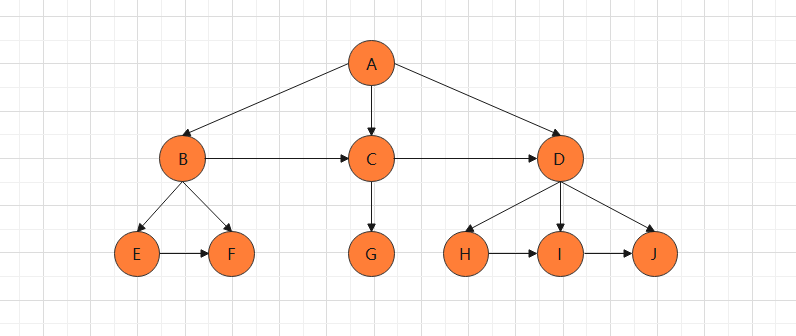

## 二叉树、树、森科转换

#### 一、树转二叉树

步骤一：同一层兄弟（同一双亲）元素相连

步骤二：移除双亲与非长子（左子树）的连接

步骤三：整理得二叉树

 

#### 二、森林转二叉树

步骤一：同一层元素相连

步骤二：移除双亲与非长子（左子树）的连接

步骤三：整理得二叉树

 

#### 三、二叉树转树、森林

步骤一：若结点（X）是其双亲（Y）的左孩子，则将结点的右孩子，右孩子的右孩子..... 于结点Y相连

步骤二：去除双亲与右孩子的连接

步骤三：整理得树，森林

