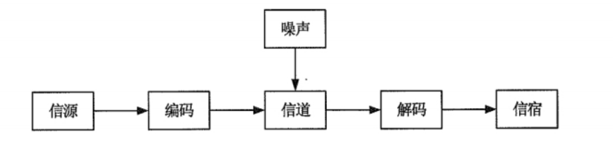
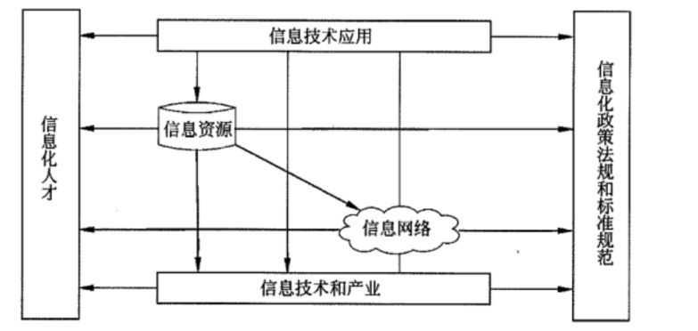

## 💥信息与信息化

### 一、信息与信息化

1、信息： **客观事物状态** 和 **运动特征** 的一种普遍形式

2、信息的传输模型

3、信息的质量属性

* 精确性：对事物状态描述的精准程度
* 完整性：对事物状态描述的全面性，完整信息应包括所有重要事实
* 可靠性：信息的来源、采集方法、传输过程是可以信任的，符合预期
* 及时性：获得信息的时刻与事件发生时刻的间隔长短
* 经济性：信息获取、传输带来的成本在可以接受的范围之内
* 可验证性：信息的主要质量属性可以被证实或者证伪的程度。
* 安全性：在信息的生命周期中，信息可以被非授权访问的可能性（可能性越低，安全性越高）

4、确保数据完整性的技术有哪些？

* CA认证
* 数字签名
* 防火墙系统
* 传输安全（通信安全）
* 入侵检测系统

5、信息系统具有哪些特点：

* 目的性：系统要有明确的目标
* 可嵌套性：系统下可以有多个子系统，系统之间也能够耦合成更大系统
* 稳定性：在规则范围内，系统内部结构和秩序是可以预见的
* 开放性：系统的可访问性
* 脆弱性：系统某一部分可能存在丧失结构、功能、秩序的特性（难以被外界发现）
* 健壮性：当系统面临干扰、输入错误等因素时，系统应该要尽可能避免出现非预期的状态

6、信息化从“小”到“大”分层以下5个层次（排序）：

* 产品信息化
* 企业信息化
* 产业信息化
* 国民经济信息化
* 社会生活信息化

7、信息化的主体、时域、空域、手段、途径、目标

* 信息化的主体：全体社会成员，包括政府、企业、事业、团体和个人
* 时域：是一个长期 的过程
* 空域：是政治、经济、文化、军事和社会的一切领域
* 手段：基于现代信息技术的先进社会生产工具
* 途径：创建信息时代的社会生产力，推动社会生产关系及社会上层建筑的改革
* 目标：使国家的综合实力、社会的文明素质和人民的生活质量全面提升

### 二、国家信息化

1、“十三五” 规划纲要

将培育**人工智能**、**移动智能终端**、**第五代移动通信(5G)**、**先进传感器**等作为新一代信息技术产业创新重点发展，拓展新兴产业发展空间

2、国家信息化体系要素

* `两网`：政务内网和政务外网
* `一站`：指政府门户网站
* `四库`：建立人口、法人单位，空间地理和自然资源，宏观经济等四个基础数据库
* `四库`，办公业务资源信息系统、金宏工程、金税工程、金关工程、金财工程、金卡工程、金审
  工程、金盾工程、金保工程、金农工程、金水工程、金质工程

3、国家信息化体系的六要素

* 信息技术应用（`龙头`）

  国家信息化建设的**主阵地**，体现了国家信息化建设的需求和效益

* 信息资源（`核心任务`）

  信息资源的开发利用是国家信息化的核心任务，是国家信息化建设取得实效的关键

* 信息网络（`基础`）

  信息网络是**信息资源开发利用和信息技术应用**的基础，是信息传输、交换和共享的必要手段

* 信息技术和产业（`基础`）

  信息技术和产业是我国进行**信息化建设**的基础，必须大力发展自主的信息产业
  
* 信息化人才（`成功之本`）

  信息化人才是国家信息化成功之本，对其他各要素的发展速度和质量有着决定性的影响，是信息化建设的关键:
  
* 信息化法规政策和标准规范（`保障`）

  信息化政策法规和标准规范用于规范和协调信息化体系各要素之间关系，是国家信息化快速、持续、有序、健康发展的根本保障

4、信息技术发展趋势和新技术应用主要包括以下十个方面

* 高速度大容量
* 集成化和平台化
* 智能化
* 虚拟计算
* 通信技术
* 遥感和传感技术
* 移动智能终端
* 以人为本
* 信息安全
* **两化融合**：工业化与信息化

### 三、电子政务

1、类型

* 政府间的电子政务（G2G）
* 政府对企业的电子政务 （G2B）
* 政府对公众的电子政务 （G2C）
* 政府对公务员 （G2E）

2、我国电子政务建设的主要任务

* 建设和整合统一的电子政务网络
* 建设和完善重点业务系统
* 规划和开发重要政务信息资源
* 积极推进公共服务
* 基本建立电子政务网络与信息安全保障体系

3、我国电子政务建设要坚持哪几个原则

* 统一规划，加强领导
* 需求主导，突出重点
* 整合资源，拉动产业
* 统一标准，保障安全

4、”十二五“ 电子政务的发展规划是什么？

* 电子政务统筹协调发展不断深化:应用发展取得重大进展;
* 政府公共服务和管理应用成效明显，电子政务信息共享和业务协同取得重大突破，电子政务技术服务能力明显加强:
* 电子政务信息安全保障能力持续提升

### 四、企业信息化

1、企业信息化概述

企业信息化是指企业以业务流程的优化和重构为基础，在一定的深度和广度上利用计算机技术、网络技术和数据库技术，控制和集成化管理企业生产经营活动中的各种信息，实现企业内外部信息的共享和有效利用，以提高企业的经济效益和市场竞争

2、企业信息化结构

* 产品(服务)层
* 作业层
* 管理层
* 决策层

3、推进企业信息化发展过程中应遵循以下原则 

* 效益原则
* `”一把手“ 原则`
* 中长期与短期建设相结合原则
* 规范化和标准化原则
* 以人为本的原则

4、 **企业资源计划**（Enterprise Resources Planning，**ERP**）

* ERP 是一个以财务会计为核心的信息系统，用来识别和规划企业资源及优化，从而达到最佳资源组合，使企业利润最大化
* ERP 的核心管理思想就是`实现对整个供应链的有效管理`
* 特点：ERP 是统一的集成系统；ERP 是面向业务流程的系统；ERP 是模块化可配置的；ERP 是开放的系统；

5、 **客户关系管理**（Customer Relationship Management，**CRM**）

* CRM 注重的是与客户的交流，企业的经营是以客户为中心（改善企业与客户之间关系的新型管理机制）
* CRM 把帮助企业提高获取利润的能力作为重要指标（集成了信息系统和办公系统）
* 客户数据可以分为`描述性`、`促销性`和`交易性`数据三大类（得会区分）
* CRM 由两部分构成，即触发中心和挖掘中心
  * 触发中心是指客户和CRM 通过电话、传真、Web、E-mail 等多种方式“触发”进行沟通;
  * 挖掘中心则是指CRM 记录交流沟通的信息和进行智能分析

* 特点：`可伸缩性`；`可移植性`；

客户数据可以分为描述性、促销性和交易性数据三大类

* 关于描述性数据：客户的基本信息，如果是个人客户，一定要涵盖客户的姓名、年龄、 ID 和联系方式等:如果是企业客户，一定要涵盖企业的名称、规模、联系人和法人代表等
* 关于促销性数据：体现企业曾经为客户提供的产品和服务的历史数据，主要包括用户产品使用情况调查的数据、促销活动记录数据、客服人员的建议数据和广告数据等。
* 关于交易性数据：反映客户对企业做出的回馈的数据，包括历史购买记录数据、投诉数据、请求提供咨询及其他服务的相关数据、客户建议数据等

合格的 CRM 系统至少需要包含以下几个比较基本的功能模块

* 自动化的销售
* 自动化的市场营销
* 自动化的客户服务

在 ERP 系统中属于物流管理模块功能的有哪些

* 销售管理
* 库存控制
* 采购管理
* 人力资源管理

5、**供应链管理**（Supply Chain Management，**SCM**）

* 核心是供应链。
* 供应链是指一个整体的网络用来传送产品和服务，从原材料开始一直到最终客户(消费者)，它凭借个设计好的`信息流`、`物流` 和 `现金流` 来完成。
* 现代意义的供应链是`利用计算机网络技术全面规划供应链中的商流、物流、信息流、资金流等并进行计划、组织、协调和控制`。
* 特点：`交叉性`；`动态性`；`存在核心企业`；`复杂性`；`面向用户`；

供应链系统设计的原则

* 自顶向下和自底向上相结合
* 简洁性原则
* 取长补短原则
* 动态性原则
* 合作性原则
* 创新性原则
* 战略性原则

### 五、电子商务

1、类型

* 企业与个人的交易（B2C）天猫、苏宁
* 企业之间的交易（B2B）阿里巴巴
* 个人与个人之间的交易（C2C）淘宝
* 线上与线下（O2O）美团

2、参与电子商务的实体有四类

* 顾客 (个人消费者或企业集团)
* 商户 (包括销售商、制造商、储运商)
* 银行(包括发卡行、收单行)
* 认证中心

### 六、商业智能

1、商业智能（Business Intelligence，**BI**） 

* **将组织中现有的数据转化为知识**，帮助组织做出明智的业务经营决策。
* 为了将数据转化为知识，需要利用数据仓库、联机分析处理 (On-Line Analytics Process,OLAP) 工具和数据挖掘等技术。
* **商业智能一般由数据仓库、联机分析处理、数据挖掘、数据备份和恢复等部分组成。商业智能系统应具有的主要功能: 数据仓库、数据 ETL、数据统计输出(报表)分析功能 OLAP**。
* 商业智能实现有三个层次：`数据报表`、`多维数据分析`、`数据挖掘`

2、商业智能项目的实施步骤可分为如下 6 步骤：

* 需求分析
* 数据仓库建模
* 数据抽取
* 建立商业智能分析报表
* 用户培训和数据模拟测试
* 系统改进和完善

3、数据库与数据仓库的主要区别是?

* 数据库是面向**事务**的设计；数据仓库是面向**主题**的设计
* 数据库存储的一般是**在线交易数据**；数据仓库存储的一般是**历史数据**
* 数据库设计是尽量避免冗余，一般采用**符合范式**的规则来设计；数据仓库在设计时有意引入冗余，采用**反范式**的方式来设计
* 数据库是为捕获数据而设计，数据仓库是为分析数据而设计。出于决策的需要，数据仓库中的数据都要标明时间属性。
* 数据库的操作者是一般的企业技术人员，而数据仓库的使用者一般是企业的领导层或决策层。

### 七、新一代信息技术

1、大数据

特点： `Volume (大量)`；`Velocity (高速)`；`Variety (多样)`；`Value (价值密度低)`；`Veracity (真实性)`；

大数据从数据源经过分析挖掘到最终获得价值一般需经过 5 个主要环节

* 数据准备
* 数据存储与管理
* 计算处理
* 数据分析
* 知识展现

大数据关键技术

* 大数据存储管理技术
* 大数据并行分析术
* 大数据分析技术

2、云计算

类型：

* IaaS：基础设施即服务（阿里云）
* SaaS：软件即服务（jira办公软件）
* PaaS：平台即服务（操作系统、数据库管理系统、Web应用）
* DaaS：数据即服务

3、互联网+（智慧城市）

