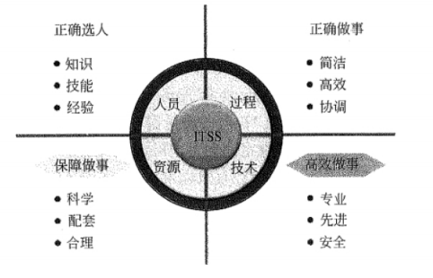
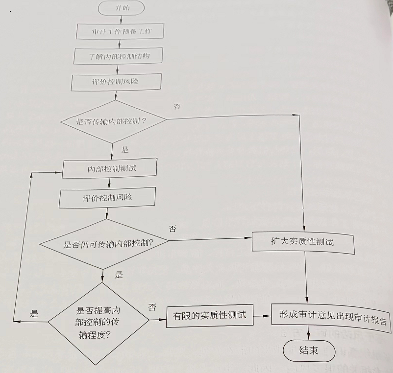

## 💥信息系统集成及服务

1、信息技术基础架构库（ITIL）

简介： 最初是为了提高英国政府部门 IT 服务质量而开发，但它很快在英国的各个企业中得到了广泛的应用和认可。 ITIL 包含着如何管理IT 基础设施的流程描述，以流程为向导、以客户为中心，通过整合 IT 服务与企业服务提高企业的IT 服务提供和服务支持的能力和水平。

2、IT 服务管理（ITSM）

实施 ITSM 的根本目标 （重点）

* 以客户为中心提供IT 服务
* 提供高质量、低成本的服务
* 提供的服务是可准确计价的

3、信息技术服务标准（ITSS）

ITSS 组成要素（PPTR）（重点）

* 人员（P）：指提供IT 服务所需的人员及其知识、经验和技能要求；
* 流程（P）：指提供 IT服务时，合理利用必要的资源，将输入转化为输出的一组相互关联和结构化的活动
* 技术（T）：指交付满足质量要求的IT 服务应使用的技术或应具备的技术能力
* 资源（R）：指提供IT服务所依存和产生的有形及无形资产

ITSS 生命周期（PIOIS）（重点）

* 规划设计
* 部署实施
* 服务运营
* 持续改进
* 监督管理

4、信息系统审计（重点）

目的：评估并提供反馈、保证及建议。

其关注之处可被分为如下3类

* 可用性：商业高度依赖的信息系统能否在任何需要的时刻提供服务?信息系统是否被完好保 护以应对各种损失和灾难
* 保密性：系统保存的信息是否仅对需要这些信息的人员开放，而不对其他任何人开放
* 完整性：信息系统提供的信息是否始终保持正确、可信、及时?能否防止未授权的对系统数据和软件的修改

