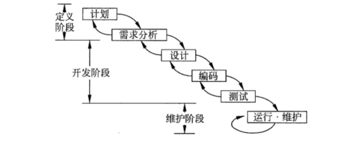
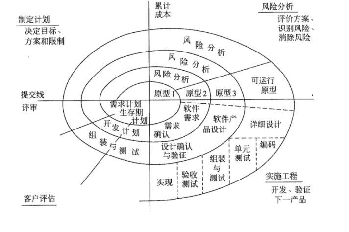
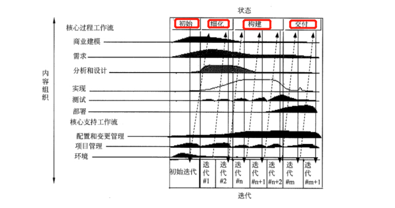
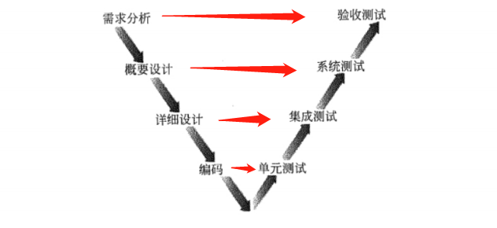
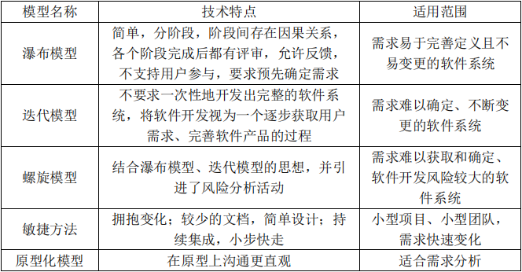
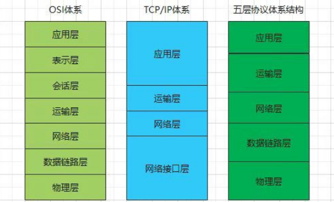

## 💥信息系统集成专业技术

### 一  信息系统建设

#### 1 信息系统生命周期

* **立项阶段**：即概念阶段或需求阶段，这一阶段根据用户业务发展和经营管理的需要，提出建设信息系统的初步构想，然后对企业信息系统的需求进行深入调研和分析，形成《需求规格说明书》并确定立项。
* **开发阶段**： 以立项阶段所做的需求分析为基础，进行总体规划。之后，通过系统分析、系统设计、系统实施、系统验收等工作实现并交付系统。
* **运维阶段**：信息系统通过验收，正式移交给用户以后，进入运维阶段。要保障系统正常运行，系统维护是一项必要的工作。系统的运行维护可分为更正性维护、适应性维护、完善性维护、预防性维护等类型。
* **消亡阶段**：信息系统不可避免地会遇到系统更新改造、功能扩展，甚至废弃重建等情况。对此，在信息系统建设的初期就应该注意系统消亡条件和时机，以及由此而花费的成本。

 

#### 2  信息系统开发方法

* **结构化方法**：是应用最为广泛的一种开发方法。把整个系统的开发过程分为若干阶段，`每个阶段和主要步骤都有明确详尽的文档编制要求，并对其进行有效控制`。对应的开发模型：`瀑布模型`
  * 注重开发过程的整体性和全局性
  * 开发周期长（文档、设计说明繁琐，工作效率低）
  * 开发之初全面认识系统的需求，充分预料各种可能发生的变化（并不十分现实）
* **原型法**：其认为在`无法全面准确地提出用户需求的情况下`，并不要求对系统做全面、详细的分析，而是基于对用户需求的初步理解，先快速开发一个原型系统，然后通过反复修改来实现用户的最终系统需求。对应的开发模型：`原型化模型`
  * 对用户的需求是动态响应、逐步纳入的
  * 系统分析、设计与实现都是随着对原型的不断修改而同时完成的，相互之间并无明显界限，也没有明确分工。
  * 原型又可以分为抛弃型原型(Throw-It-AwayPrototype ) 和进化型原型(Evolutionary Prototype) 两种。
* **面向对象方法**：用对象表示客观事物，对象是一个严格模块化的实体，在系统开发中可被共享和重复引用，以达到复用的目的。
  * 其关键是能否建立一个全面、合理、统一的模型，既能反映需求对应的问题域，也能被计算机系统对应的求解域所接受。
  * 面向对象方法主要涉及 分析、设计 和 实现 三个阶段。
  * 其特点是在整个开发过程中使用的是同一套工具。整个开发过程实际上都是对面向对象三种模型的建立、补充和验证。因此，其分析、设计和实现三个阶段的界限并非十分明确。

 

#### 3  信息系统开发模型

##### 3.1 瀑布模型（结构化方法）

它把软件开发的过程分为软件计划、需求分析、软件设计、程序编码、软件测试和运行维护六个阶段，规定了它们`自上而下`、相互衔接的固定次序，如同瀑布流水，逐级下落。

特点：**从上一项开发活动接受其成果作为本次活动的输入；利用这一输入，实施本次活动应完成的工作内容**

##### 3.2 原型化模型（原型法）

`原型化模型是为弥补瀑布模型的不足而产生的`

特点：原型化模型的第一步是建造一个快速原型，实现客户或未来的用户与系统的交互，经过和用户针对原型的讨论和交流，弄清需求以便真正把握用户需要的软件产品是什么样子的。充分了解后，再在原型基础上开发出用户满意的产品。在实际中原型化经常在需求分析定义的过程进行。

##### 3.3 螺旋模型

螺旋模型将瀑布模型和快速原型模型相结合，综合了两者的优点，并`增加了风险分析`。它以原型为基础，沿着螺线自内向外旋转，每旋转一圈都要经过制定计划、风险分析、实施工程及客户评价等活动，并开发原型的一个新版本。

特点：**强调了风险风析，特别适用于庞大而复杂的、高风险的系统**

##### 3.4 迭代模型

迭代包括产生产品发布(稳定、可执行的产品版本) 的全部开发活动和要使用该发布必需的所有其他外围元素。所以，在某种程度上，开发迭代是一次完整地经过所有工作流程的过程:(至少包括)需求工作流程、分析设计工作流程实施工作流程和测试工作流程。在迭代模型中，每一次的迭代都会产生一个可以发布的产品，这个产品是最终产品的一个子集。

特点：**适用于项目事先不能完整定义产品所有需求、计划多期开发的软件开发**。

在现代的开发方法中，例如 XP、RUP 等，无例外地都推荐、主张采用能显著**减少风险**的迭代模型。

##### 3.5 敏捷方法

敏捷方法（适应型生命周期 或 变更驱动方法）是一种以人为核心、迭代、循序渐进的开发方法

特点：适用于一开始并没有或不能完整地确定出需求和范围的项目，或者需要应对快速变化的环境，或者需求和范围难以事先确定，或者能够以有利于干系人的方式定义较小的增量改进。

##### 3.6 V 模型

以测试为中心的开发模型

##### 3.7 开发模型总结

 

#### 4 信息系统设计

* 系统总体设计：包括系统的总体架构方案设计、软件系统的总体架构设计、数据存储的总体设计、计算机和网络系统的方案设计等。
* 系统详细设计：包括代码设计、数据库设计、人/机界面设计、处理过程设计等。

### 二  软件工程

**注：软件工程不只下面所涉及的知识点，挑大头部分，具体看课本**

#### 1 软件设计

* 概要设计：（高层设计）将软件需求转化为数据结构和软件的系统结构。
* 详细设计：（低层设计）对结构图进行细化，得到详细的数据结构与算法。

 

#### 2 软件测试

常用的测试方法：

* 黑盒测试：不考虑程序的内部结构，需求和功能测试，主要是在程序的接口上进行测试，它不涉及程序的内部逻辑。除了测试程序外，它还适用于对需要分析阶段的软件文档进行测试。

* 白盒测试：把测试对象看作一个透明的盒子，对程序所有逻辑路径进行测试。

测试分为几个阶段：

* 单元测试（模块测试）：是对每个模块进行测试。要理解驱动模块和桩模块。主要目的是针对编码过程中可能存在的各种错误，例如用户输入验证过程中的边界值的错误。
* 集成测试：在单元测试的基础上，将所有模块按照设计要求组装成系统，必须精心计划，应提交集成 测试计划、尤其是检查各单元与其集成测试规格说明书和集成测试分析报告。主要目的是针对详细设计中可能存在的问题，他程序部分之间的接口上可能存在的错误。
* 确认测试：验证软件的功能、性能以及其他特性是否与用户的要求一致。
* 系统测试：将软件放在整个计算机环境下，在实际运行环境中进行一系列的测试，发现软件与系统定义不符合或矛盾的地方。
* Alpha 测试：是在开发环境进行的测试
* Beta 测试：是用户在实际环境中进行的测试，开发者不在旁边
* 回归测试：是指修改了旧代码后，重新进行测试以确认修改没有引入新的错误或导致其他代码产生错误。在给定的预算和进度下，尽可能有效率地进行回归测试，需要对测试用例库进行维护并依据一定 的策略选择相应的回归测试包。

 

#### 3 软件维护

（占整个软件生命周期的 60%~80%）软件维护的类型主要有以下 4 种:

* 改正性维护---改正交付后发现的错误
* 预防性维护---预防潜在的错误
* 适应性维护---为适用环境变化
* 完善性维护---优化性能和维护性

#### 4 软件配置管理

软件配置管理通过标识产品的组成元素、管理和控制变更、验证、记录和报告配置信息，来控制产品的进化和完整性。软件配置管理与软件质量保证活动密切相关，可以帮助达成软件质量保证目标。

软件配置管理活动包括软件配置管理计划、软件配置标识、软件配置控制、软件配置状态记录、软件配置审计、软件发布管理与交付等活动。

 

#### 5 软件质量保证及质量评价

软件质量指的是软件特性的总和，是软件满足用户需求的能力，即遵从用户需求，达到用户满意。软件质量包括“内部质量”、“外部质量”和“使用质量”三部分。软件需求定义了软件质量特性，及确认这些特性的方法和原则。

软件质量管理过程由许多活动组成，一些活动可以直接发现缺陷，另一些活动则检查活动的价值。其中包括质量保证过程、验证过程、确认过程、评审过程、审计过程等。

* 软件质量保证：通过制定计划、实施和完成等活动保证项目生命周期中的软件产品和过程符合其规定的要求。

* 验证与确认： 确定某一活动的产品是否符合活动的需求，最终的软件产品是否达到其意图并满足用户需求。

  验证过程试图确保活动的输出产品已经被正确构造，即活动的输出产品满足活动的规范说明:确认过程则试图确	保构造了正确的产品，即产品满足其特定的目的。

*  评审与审计:包括管理评审、技术评审、检查、走查、审计等。管理评审的目的是监控进展，决定计划和进度的状态，或评价用于达到目标所用管理方法的有效性。技术评审的目的是评价软件产品，以确定其对使用意图的适合性。
  软件审计的目的是提供软件产品和过程对于可应用的规则、标准、指南、计划和流程的遵从性的独立评价。审计是正式组织的活动，识别违例情况，并要生成审计报告，采取更正性行动。

### 三 软件架构

**注：软件架构不只下面所涉及的知识点，挑大头部分，具体看课本**

#### 1 软件中间件

**中间件是位于硬件、操作系统等平台和应用之间的通用服务**。借由中间件，解决了分布系统的异构问题。

分类：

* **数据库访问中间件**：通过一个抽象层访问数据库，从而允许使用相同或相似的代码访问不同的数据库资源。典型技术如 Windows 平台的 ODBC 和Java 平台的JDBC 等
* **远程过程调用中间件** （RPC）：是一种分布式应用程序的处理方法
* **面向消息中间件** （MOM）：利用高效可靠的消息传递机制进行平台无关的数据传递，并可基于数据通信进行分布系统的集成。典型产品如 IBM的MOSeries
* **分布式对象中间件**：是建立对象之间客户/服务器关系的中间件，结合了对象技术与分布式计算技术。典型产品如 OMG 的CORBA、Java 的 RMI/FJB、Microsoft 的DCOM 等
* **事务中间件**：也称事务处理监控器 (Transaction Processing Monitor,TPM)，提供支持大规模事务处理的可靠运行环境

 

#### 2 典型架构模式

* 管道/过滤器模式---批处理系统---各功能模块高内聚低耦合的特性；
* 面向对象模式---基于组件的软件开发；
* 事件驱动模式---各种图形界面应用；
* 分层模式---分层通信协议；
* 客户/服务器模式 (C/S)式---浏览器/服务器模式B/S 模式；

### 四 计算机网络知识

**注：计算机网络知识不只下面所涉及的知识点，挑大头部分，具体看课本**

#### 1 OSI 协议

OSI 采用了分层的结构化技术、从下到上分为七层

| 协议层     | 标准                         | 协议                          | 作用                                                         |
| ---------- | ---------------------------- | ----------------------------- | ------------------------------------------------------------ |
| 物理层     | 该层包括物理连网媒介         | RS232、V.35、RJ-45、FDDI      |                                                              |
| 数据链路层 | 控制网络层与物理层之间的通信 | IEEE 802.3/.2、HDLC、PPP、ATM | 它控制网络层与物理层之间的通信。它的主要功能是将从网络层接收到的数据分制成特定的可被物理层传输的帧。 |
| 网络层     |                              | IP、ICMP、IGMP、IPX、ARP      | 将网络地址(例如，IP 地址)翻译成对应的物理地址                |
| 传输层     |                              | TCP、UDP、SPX                 | 要负责确保数据可靠、顺序、无错地从A 点传输到 B 点            |
| 会话层     |                              | RPC、SOL、NFS                 | 负责在网络中的两节点之间建立和维持通信，以及提供交互会话的管理功能 |
| 表示层     | 应用程序和网络之间的翻译官   | JPEG、ASCII、GIF、DES、MPEG   | 管理数据的解密加密、数据转换、格式化和文本压缩               |
| 应用层     |                              | HTTP、Telnet、FTP、SMTP       | 负责对软件提供接口以使程序能使用网络服务，如事务处理程序、文件传送协议和网络管理等 |

#### 

 

#### 2 网络规划、设计与实施

**确立网络的物理拓扑结构是整个网络方案规划的基础**

选择拓扑结构时，应该考虑的主要因素

* 地理环境
* 传输介质
* 距离
* 可靠性

在分层设计中，引入了三个关键层的概念，分别是`核心层`、`汇聚层`和`接入层`

 

#### 3 网络安全

信息安全的基本要素

* 机密性：确保信息不暴露给未授权的实体或进程
* 完整性：只有得到允许的人才能修改数据，并且能够判别出数据是否已被篡改。
* 可用性：得到授权的实体在需要时可访问数据，即攻击者不能占用所有的资源而阻碍授权者的工作。
* 可控性：可以控制授权范围内的信息流向及行为方式。
* 可审查性： 对出现的网络安全问题提供调查的依据和手段

典型的网络攻击步骤

* 信息收集
* 试探寻找突破口
* 实施攻击
* 消除记录
* 保留访问权限

信息系统安全级别

* 自主保护级
* 系统审计保护级
* 安全标记保护级
* 结构化保护级
* 访问验证保护级

传统防火墙无法阻止和检测基于数据内容的黑客攻击和病毒入侵，同时也无法控制内部网络之间的违规行为

扫描器可以说是入侵检测的一种，主要用来发现网络服务、无法发现正在进行的入侵行为，而且它还有可能成为攻击者的工具

防毒软件对于基于网络的攻击行为 (如扫描、针对漏洞的攻击) 却无能为力

安全审计系统通过独立的、对网络行为和主机操作提供全面与忠实的记录，方便用户分析与审查事故原因