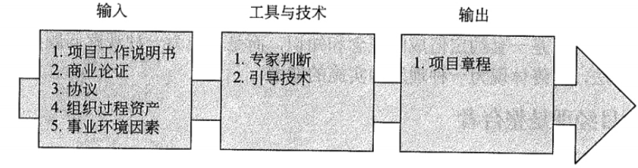
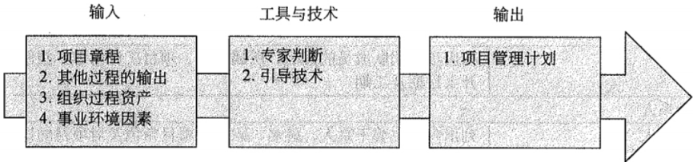
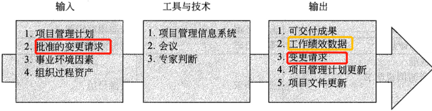
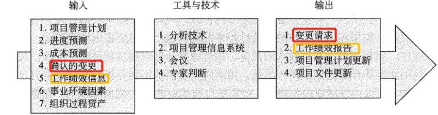
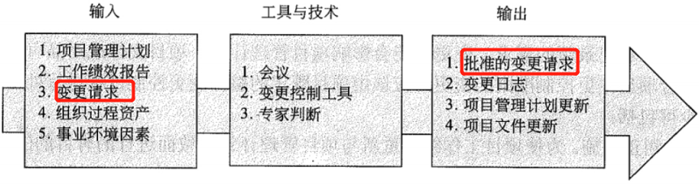
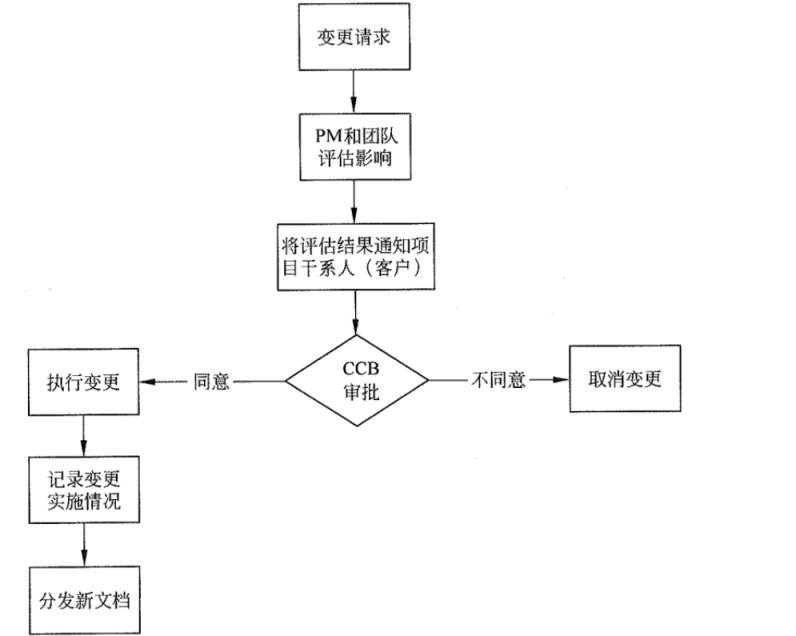
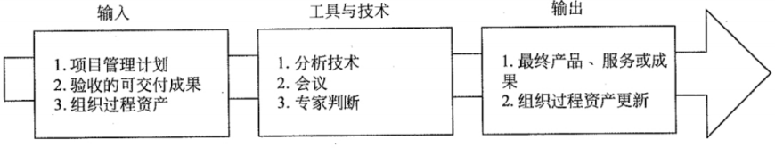

## 💥十大知识领域：项目整体管理

> 项目整体管理包括以下 6 个过程:
>
> * 制定项目章程
> * 定项目管理计划
> * 指导与管理项目工作
> * 监控项目工作
> * 实施整体变更控制
> * 结束项目或阶段过程

### 一、制定项目章程

> 制定项目章程。编写一份正式文件的过程，这份文件就是项目章程。通过发布项目章程，`正式地批准项目并授权项目经理在项目活动中使用组织资源`

1、对项目章程的描述（重点）

* `项目章程宣告一个项目的正式启动、项目经理的任命，并对项目的目标、范围、主要可交付成果、主要制约因素与主要假设条件等进行总体性描述`
* `通常由高级管理层签发项目章程，项目经理可以参与编写，但不能签发以及修改`
* `项目章程不能太抽象，也不能太具体`
* `项目章程遵循"谁签发，谁有权修改"的原则`

 

2、项目章程的作用（了解）

* 确定项目经理，规定项目经理的权力
* 正式确认项目的存在，给项目一个合法的地位
* 规定项目的总体目标，包括范围、时间、成本和质量等
* 通过叙述启动项目的理由，把项目与执行组织的日常经营运作及战略计划等联系起来

 

3、**项目章程的主要内容（案例题，背诵）**

* 概括性的项目描述和项目产品描述
* 项目的目的或批准项目的理由
* 项目的总体要求，包括项目的总体范围和总体质量要求
* 可测量的项目目标和相关的成功标准
* 项目的主要风险
* 项目的总体里程碑进度计划
* 项目的总体预算
* 项目的审批要求（在项目的规划、执行、监控和收尾过程中，应该由谁做出哪种批准）
* 委派的项目经理及其职责和职权
* 发起人或其他批准项目章程的人员姓名和职权

 

4、制定项目章程的输入、输出、工具与技术（挑重点，具体看课本）

* 输入：项目工作说明书（SOW）。项目说明书包括哪些内容：业务需要； 产品范围描述；战略计划；
* 工具与技术：引导技术。`头脑风暴、冲突处理、问题解决和会议管理等，都是引导者可以用来帮助团队和个人完成项目活动的关键技术`

### 二、制定项目管理计划

> 制定项目管理计划。定义、准备和协调所有子计划，并把它们整合为一份综合项目管理计划的过程。项目管理计划包活经过整合的项目基准和子计划。

1、对项目管理计划的描述（重点）

* `制订项目管理计划是一个收集其他规划过程的结果，并汇成一份综合的、经批准的、现实可行的、正式的项目计划文件的过程`
* `项目管理计划可能不只是要得到管理层的批准，可能还需要得到其他主要项目干系人的批准`
* `项目管理计划必须是自下而上制订出来的`
* ` 在制订项目管理计划的过程中，项目经理和项目团队成员也要充分听取其他主要项目干系人的意见，以便把干系人的需求尽可能地反映在项目管理计划中，以避免干系人对项目的执行结果产生分歧`
* 项目上的任何文件都需要项目上的所有人一起制定
* 任何项目文件不是一成不变的，需要根据项目进展，逐步完善

 

2、项目管理计划的作用（了解）

* 指导项目执行、监控和收尾
* 为项目绩效考核和项目控制提供基准
* 记录制订项目计划所依据的假设条件
* 记录制订项目计划过程中的有关方案选择
* 促进项目干系人之间的沟通
* 规定管理层审查项目的时间、内容和方式

 

3、**项目管理计划的主要内容（案例题，背诵）**

* 所使用的项目管理过程
* 每个特定项目管理过程的实施程度
* 完成这些过程的工具和技术的描述
* 项目所选用的生命周期及各阶段将采用的过程
* 如何用选定的过程来管理具体的项目。包括过程之间的依赖与交互关系和基本的输入和输出
* 如何执行工作来完成项目目标及对项目目标的描述
* 如何监督和控制变更、明确如何开展配置管理。
* 对维护项目绩效基线的完整性的说明
* 与项目干系人进行沟通的要求和技术
* 为项目选择的生命周期模型
* 为解决某些遗留问题和未定的决策，对于其内容、严重程度进行的关键管理评审。

### 三、指导与管理项目工作

> 指导与管理项目工作。为实现项目目标而领导和执行项目管理计划中所确定的工作，并实施已批准变更的过程。

1、指导与管理项目工作的描述（重点）

* `指导与管理项目工作通常以 ”开踢会议" 为开始标志`

 

2、指导与管理项目工作还须对项目所有变更的影响进行审查，并实施已批准的变更，活动包括:

* 纠正措施。为使项目工作绩效重新与项目管理计划**一致**而进行的有目的的活动。
* 预防措施。为确保项目工作的**未来**绩效符合项目管理计划而进行的有目的的活动。
* 缺陷补救。为了**修正**不一致的产品或产品组件而进行的有目的的活动。

### 四、监控项目工作

> 监控项目工作。跟踪、审查和报告项目进展，以实现项目管理计划中确定的绩效目标的过程。

1、监控项目工作的描述（重点）

* `监督是贯穿于整个项目的项目管理活动之一`

 

2、监控项目工作的输入、输出、工具与技术（挑重点，具体看课本）

* 分析技术：回归分析；分组方法；因果分析；根本原因分析；预测方法；失效模式与影响分析（FMEA）；故障树分析（FTA）；储备分析（应急储备、管理储备）；趋势分析；挣值管理（EV / PV / AC 计算题）；

### 五、实施整体变更控制

> 实施整体变更控制。审查所有变更请求，批准变更，管理对可交付成果、组织过程资产、项目文件和项目管理计划的变更，并对变更处理结果进行沟通的过程。

1、实施整体变更控制的描述（重点）

* `实施整体变更控制过程贯穿项目始终，并且应用于项目的各个阶段。项目经理对此负最终责任`
* `项目的任何干系人都可以提出变更请求。尽管可以口头提出，但所有变更请求都必须以书面形式记录，并纳入变更管理以及配置管理系统中`
*  `变更控制委员会（CCB） 是一个正式组成的团体，负责审查、评价、批准、推迟以及记录和传达变更处理决定`
* `变更控制委员会是由主要项目干系人的代表所组成的一个小组，项目经理可以是其中的成员之一， 但通常不是组长`

 

2、实施整体变更控制的流程图（课本原图）

完整的整体变更流程图（后期补）

### 六、结束项目或阶段过程

> 结束项目或阶段过程。完成所有项目管理过程组的所有活动，以正式结束项目或阶段的过程。

### 七、相对应到五大过程组（背）

|              | 启动过程组   | 计划过程组       | 执行过程组         | 控制过程组                        | 收尾过程组         |
| ------------ | ------------ | ---------------- | ------------------ | --------------------------------- | ------------------ |
| 项目整体管理 | 制定项目章程 | 指定项目管理计划 | 指导与管理项目计划 | 监控项目工作 实施整体变更控制 | 结束项目或阶段过程 |

### 八、补充知识点

1、项目经理是整合者：`整合者是项目经理承担的重要角色之一`、`他要通过沟通来协调，通过协调来整合。作为整合者，项目经理必须 从宏观视角来审视项目`

 

2、整合者，其主要工作包括:

* 通过与项目干系人主动、全面的沟通，来了解他们对项目的需求
* 在相互竞争的众多干系人之间寻找平衡点
* 通过认真，细致的协调，来达到各种需求间的整合与平衡

