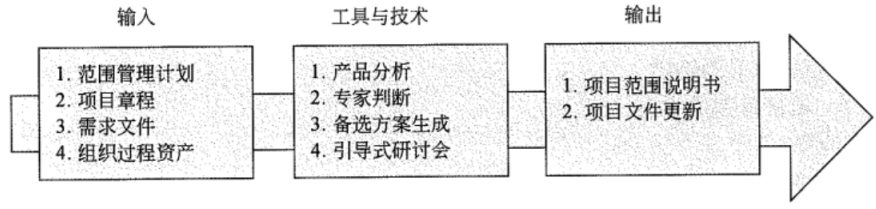
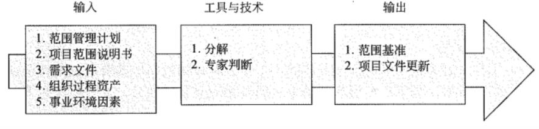
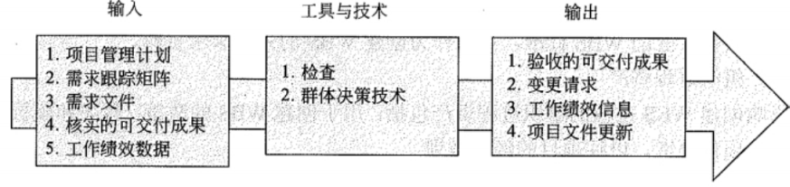
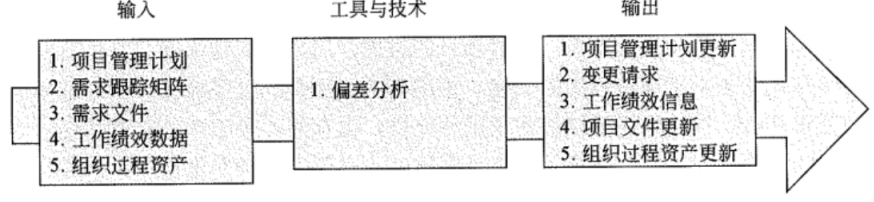

## 💥十大知识领域：项目范围管理

> 项目范围管理包括以下 6 个过程:
>
> * 编制范围管理计划过程
> * 收集需求过程
> * 定义范围过程
> * 创建工作分解结构过程
> * 确认范围过程
> * 范围控制过程

### 一、编制范围管理计划过程

> 对如何定义、确认和控制项目范围的过程进行描述

1、输出：范围管理计划做了哪些规定（了解）

* 制定详细项目范围说明书
* 根据详细项目范围说明书创建 WBS
* 维护和批准工作分解结构 (WBS)
* 正式验收已完成的项目可交付成果
* 处理对详细项目范围说明书或 WBS 的变更

### 二、收集需求过程

> 为实现项目目标，明确并记录项目干系人的相关需求的过程

课本没有流程图

| 输入                                                         | 工具与技术                                                   | 输出                      |
| ------------------------------------------------------------ | ------------------------------------------------------------ | ------------------------- |
| 范围管理计划 需求管理计划 干系人管理计划 项目章程 干系人登记册 | 访谈 焦点小组 引导式研讨会 群体创新技术 群体决策技术 问卷调查 观察 原型法 标杆对照 系统交互图 文件分析 | 需求文件 需求跟踪矩阵 |

1、群体创新技术

* 头脑风暴法
* 名义小组技术
* 概念 / 思维导图
* 亲和图
* 多标准决策分析

2、群体决策技术

* 一致同意
* 大多数原则
* 相对多数原则
* 独裁

### 三、定义范围过程

> 详细描述产品范围和项目范围，编制项目范围说明书，作为以后项目决策的基础

1、**范围说明书（案例题，背）**

* 项目范围说明书是对项目范围、主要可交付成果、假设条件和制约因素的描述。
* 项目范围说明书记录了整个范围，包括项目和产品范围。
* 项目范围说明书详细项目的可交付成果，以及为创建这些可交付成果而必须开展的工作。

2、**详细的范围说明书包含的内容（案例题，背）**

* 项目目标
* 产品范围描述
* 项目需求
* 项目边界
* 项目的可交付成果
* 项目的制约因素
* 假设条件

### 四、创建工作分解结构过程

> 把整个项目工作分解为较小的、易于管理的组成部分，形成一个自上而下的分解结构 WBS

1、范围基准包含什么？

* 经过批准的项目范围说明书
* WBS（工作分解）
* WBS 词典

2、WBS 描述

* 工作分解结构最低层的工作单元被称为**工作包**，`是我们进行进度安排、成本估算和监控的基础`
* 工作分解结构是用来确定项目范围的，项目的全部工作都必须包含在工作分解结构当中，而且不包含在工作分解结构中的任何工作都不是项目的组成部分，都不能做，否则就是`"镀金"`
* 工作分解结构的编制**需要所有项目干系人的参与**，需要项目团队成员的参与
* 工作分解结构是`逐层向下分解`的。一般情况下，工作分解结构应控制在 3-6 层为宜
* 工作分解结构中的各要素应该是`相对独立`的，要尽量`减少相互之间的交叉`

2、工作分解结构主要形式

* **树型结构**：类似于组织结构图。树型结构图的 WBS 层次清晰，非常直观，结构性强，但是不容易修改，对于大型的、复杂的项目也很难表示出项目的全景。`由于其直观性，一般在一些小的、适中的应用项目中用得较多`
* **表格结构**：类似于分级的图书目录。该表能够反映出项目所有的工作要素，可是直观性较差。但`在一些大型的、复杂的项目中使用还是较多的`，因为有些项目分解后，内容分类较多、容量较大，用缩进图表的形式表示比较方便，也可装订为手册。

3、工具与技术：**分解；如何进行分解 （案例题，背）**

* 识别和分析可交付成果及相关工作
* 确定WBS的结构和编排方法
* 自上而下逐层细化分解
* 为WBS组件制定和分配标识编码
* 核实可交付成果分解的程度是否恰当

4、**工作结构分解应把握如下原则：（案例题，背）**

* 在层次上保持项目的完整性，避免遗漏必要的组成部分
* 一个工作单元只能从属于某个上层单元，避免交叉从属。相同层次的工作单元应用相同性质
* 工作单元应能分开不同的责任者和不同的工作内容
* 项目管理的工作要放到工作分解结构中
* 最底层工作应该具有可比性，是可管理的，可定量检查的
* 应包括项目管理工作，包括分包出去的工作

### 五、确认范围过程

> 正式验收已完成的可交付成果

确认范围过程与控制质量过程的不同之处在于，前者关注可交付成果的验收，而后者关注可交付成果的正确性及是否满足质量要求。控制质量过程通常先于确认范围过程，但二者也可同时进行。

### 六、范围控制过程

> 监督项目和产品的范围状态、管理范围基准变更

### 七、相对应到五大过程组（背）

|              | 启动过程组 | 计划过程组                                                   | 执行过程组 | 控制过程组                    | 收尾过程组 |
| ------------ | ---------- | ------------------------------------------------------------ | ---------- | ----------------------------- | ---------- |
| 项目范围管理 |            | 编制范围管理计划过程 收集需求过程 定义范围过程 创建工作分解结构过程 |            | 确认范围过程 范围控制过程 |            |

