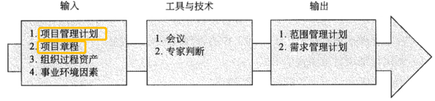

## 💥十大知识领域：项目范围管理

> 项目范围管理包括以下 6 个过程:
>
> * 编制范围管理计划过程
> * 收集需求过程
> * 定义范围过程
> * 创建工作分解结构过程
> * 确认范围过程
> * 范围控制过程

### 一、编制范围管理计划过程

> 对如何定义、确认和控制项目范围的过程进行描述

1、输出：范围管理计划做了哪些规定（了解）

* 制定详细项目范围说明书
* 根据详细项目范围说明书创建 WBS
* 维护和批准工作分解结构 (WBS)
* 正式验收已完成的项目可交付成果
* 处理对详细项目范围说明书或 WBS 的变更

### 二、收集需求过程

> 为实现项目目标，明确并记录项目干系人的相关需求的过程

### 三、定义范围过程

> 详细描述产品范围和项目范围，编制项目范围说明书，作为以后项目决策的基础

### 四、创建工作分解结构过程

> 把整个项目工作分解为较小的、易于管理的组成部分，形成一个自上而下的分解结构 WBS

### 五、确认范围过程

> 正式验收已完成的可交付成果

### 六、范围控制过程

> 监督项目和产品的范围状态、管理范围基准变更

### 七、相对应到五大过程组（背）

|              | 启动过程组 | 计划过程组                                                   | 执行过程组 | 控制过程组                    | 收尾过程组 |
| ------------ | ---------- | ------------------------------------------------------------ | ---------- | ----------------------------- | ---------- |
| 项目范围管理 |            | 编制范围管理计划过程 收集需求过程 定义范围过程 创建工作分解结构过程 |            | 确认范围过程 范围控制过程 |            |

### 八、补充知识点