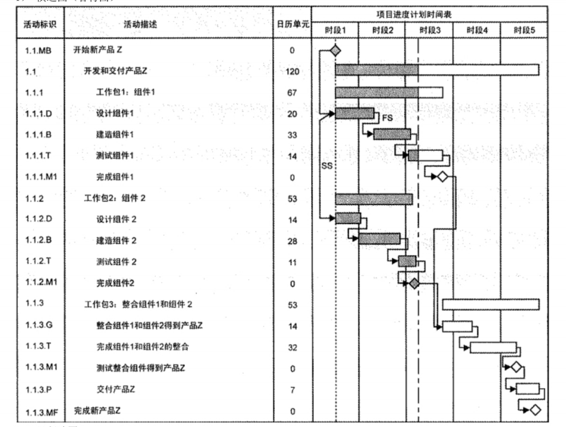

## 💥十大知识领域：项目进度管理

**主要考计算题**

> 项目进度管理包括以下 7 个过程:
>
> * 规划进度管理过程
> * 定义活动过程
> * 排列活动顺序过程
> * 估算活动资源过程
> * 估算活动持续时间过程
> * 制定进度计划过程
> * 控制进度过程

### 一、规划进度管理过程

> 制定政策、程序和文档以管理项目进度
>
> 为如何在整个项目过程中管理、执行和控制项目进度提供指南和方向

| 输入                                                        | 工具与技术                     | 输出         |
| ----------------------------------------------------------- | ------------------------------ | ------------ |
| 项目管理计划 项目章程 组织过程资产 事业环境因素 | 专家判断 分析技术 会议 | 进度管理计划 |

### 二、定义活动过程

> 识别和记录为完成项目可交付成果而需采取的具体行动

| 输入                                                        | 工具与技术                       | 输出                                 |
| ----------------------------------------------------------- | -------------------------------- | ------------------------------------ |
| 进度管理计划 范围基准 组织过程资产 事业环境因素 | 分解 滚动式规划 专家判断 | 活动清单 活动属性 里程碑清单 |

1、活动的定义

* 为完成工作包所需进行的工作，是实施项目时安排工作的最基本的工作单元。**活动与工作包是 1对1或 多对1的关系**，即有可能多个活动完成一个工作包
* 定义活动过程就是识别和记录为完成项目可交付成果而需采取的所有活动。其主要作用是，**将工作包分解为活动**，作为对项目工作进行估算、进度规划、执行、监督和控制的基础

### 三、排列活动顺序过程

> 识别和记录项目活动之间的关系

| 输入                                                         | 工具与技术                                                   | 输出                            |
| ------------------------------------------------------------ | ------------------------------------------------------------ | ------------------------------- |
| 进度管理计划 活动清单 活动属性 里程碑清单 项目范围说明书 事业环境因素 组织过程资产 | 前导图法（单代号网络图） 箭线图法（双代号网络图） 确定依赖关系 提前量与滞后量 | 项目进度网络图 项目文件更新 |

1、**工具与技术：前导图法 与 箭线图法 （计算题）**

2、工具与技术：确定依赖关系

* 强制性依赖关系：法律或合同要求的或性质决定
* 选择性依赖关系：有时又称首选逻辑关系、优先逻辑关系或软逻辑关系
* 外部依赖关系：项目活动与非项目活动之间的依赖关系。这些依赖关系往往不在项目团队的控制范围内。例如，软件项目的测试活动取决于外部硬件的到货
* 内部依赖关系：项目活动之间的紧前关系，通常`在项目团队的控制之中`

### 四、估算活动资源过程

> 估算执行各项活动所需材料、人员、设备或用品的种类和数量

| 输入                                                         | 工具与技术                                                   | 输出                                           |
| ------------------------------------------------------------ | ------------------------------------------------------------ | ---------------------------------------------- |
| 进度管理计划 活动清单 活动属性 资源日历 风险登记册 活动成本估算 事业环境因素 组织过程资产 | 专家判断 备选方案分析 发布的估算数据 项目管理软件 自下而上估算 | 活动资源需求 资源分解结构 项目文件更新 |

**资源日历**：资源日历是表明每种具体资源的可用工作日或工作班次的日历。

活动成本估算：资源的成本可能影响对资源的选择。

发布的估算数据：一些组织会定期发布最新的生产率信息与资源单位成本，涉及门类众多的劳务、材料和设备，覆盖许多国家及其所属地区。

自下而上估算：是一种估算项目持续时间或成本的方法，通过从下到上逐层汇总WBS组件的估算而得到项目估算。

活动资源需求：明确了工作包中每个活动所需的资源类型和数量

**资源分解结构**：资源分解结构 (RBS)是资源依类别和类型的层级展现

### 五、估算活动持续时间过程

> 根据资源估算的结果，估算完成单项活动所需工期

| 输入                                                         | 工具与技术                                                   | 输出                          |
| ------------------------------------------------------------ | ------------------------------------------------------------ | ----------------------------- |
| 进度管理计划 活动清单 活动属性 活动资源需求 资源日历 项目范围说明书 风险登记册 资源分解结构 事业环境因素 组织过程资产 | 专家判断 类比估算 参数估算 三点估算 群体决策技术 储备分析 | 活动持续时间估算 项文更新 |

1、**三点估算（计算题）（重点）**

2、**储备分析（计算题）（重点）**

* 应急储备：与 "已知-未知” 风险相关。在进行持续时间估算时，需考虑应急储备(有时称为时间储备或缓冲时间。`应急储备是包含在进度基准中`
* 管理储备：与 "未知-未知" 风险相关。`管理储备不包含在进度基准中，但属于项目总持续时间的一部分`

### 六、制定进度计划过程

> 分析活动顺序、持续时间、资源需求和进度制约因素，创建项目进度模型

| 输入                                                         | 工具与技术                                                   | 输出                                                         |
| ------------------------------------------------------------ | ------------------------------------------------------------ | ------------------------------------------------------------ |
| 进度管理计划 活动清单 活动属性 项目进度网络图 活动资源需求 资源日历 活动持续时间估算 项目范围说明书 风险登记册 项目人员分派 资源分解结构 事业环境因素 组织过程资产 | 进度网络分析 关键路径法 关键链法 资源优化技术 建模技术 提前量和滞后量 进度压缩技术 进度计划编制工具  | **进度基准** 项目进度计划 进度数据 项目日历 项目管理计划更新 项件更新 |

1、关键路径法（CPM）、关键链法（CCM）计算题

2、资源优化技术

* 资源平衡：实现资源最优化，但往往会延长总工期
* 资源平滑：对进度模型中的活动进行调整，从而使项目资源需求不超过预定的资源限制的一种技术。 相对于资源平衡而言，资源平滑`不会改变项目关键路径，完工日期也不会延迟`。也就是说，活动只在其自由浮动时间和总浮动时间内延迟。因此，`资源平滑技术可能无法实现所有资源的优化`

3、建模技术

* 蒙特卡洛分析

4、进度压缩技术（案例题，背，看书）

* 赶工
* 快速跟进

5、**项目日历**：在项目日历中规定可以开展活动的工作日和工作班次

6、项目进度计划可以采用以下一种或多种图形来呈现

* 横道图（甘特图）

  

* 里程碑图

* 项目进度网络图

### 七、控制进度过程

> 监督项目活动状态、更新项目进展、管理进度基准变更，以实现计划

| 输入                                                         | 工具与技术                                                   | 输出                                                         |
| ------------------------------------------------------------ | ------------------------------------------------------------ | ------------------------------------------------------------ |
| 项目管理计划 项目进度计划 工作绩效数据 项目日历 进度数据 组织过程资产 | 绩效审查 项目管理软件 资源优化技术 建模技术 提前量和滞后量 进度压缩 进度计划编制工具 | 工作绩效信息 进度预测 变更请求 项目管理计划更新 项件更新 组织过程资产更新 |

1、**通常可用以下一些方法缩短活动的工期（案例题，背）**

* 赶工，投入更多的资源或增加工作时间，以缩短关键活动的工期
* 快速跟进，并行施工，以缩短关键路径的长度
* 使用高素质的资源或经验更丰富的人员
* 减小活动范围或降低活动要求
* 改进方法或技术，以提高生产效率
* 加强质量管理，及时发现问题，减少返工，从而缩短工期

### 八、相对应到五大过程组（背）

|              | 启动过程组 | 计划过程组                                                   | 控制过程组 | 监控过程组   | 收尾过程组 |
| ------------ | ---------- | ------------------------------------------------------------ | ---------- | ------------ | ---------- |
| 项目进度管理 |            | 规划进度管理过程 定义活动过程 排列活动顺序过程 估算活动资源过程 估算活动持续时间过程 制定进度计划过程 |            | 控制进度过程 |            |

