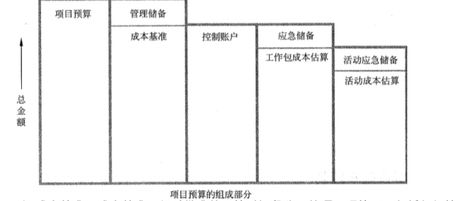

## 💥十大知识领域：项目成本管理

**主要考计算题**

> 项目进度管理包括以下 4 个过程:
>
> * 制订成本管理计划
> * 成本估算
> * 成本预算
> * 成本控制

### 一、制订成本管理计划

> 制订了项目成本结构、估算、预算和控制的标准

| 输入                                                        | 工具与技术                     | 输出                                                         |
| ----------------------------------------------------------- | ------------------------------ | ------------------------------------------------------------ |
| 项目管理计划 项目章程 事业环境因素 组织过程资产 | 专家判断 分析技术 会议 | 精确等级 测量单位 组织程序链接 控制临界值 挣值规则 报告格式 过程说明 其他细节 |

1、（了解）成本管理计划是项目管理计划的组成部分，描述将如何规划、安排和控制项目成本。包含:

* 精确等级
* 测量单位
* 组织程序链接
* 控制临界值
* 挣值规则
* 报告格式
* 过程说明
* 其他细节

### 二、成本估算

> 编制完成项目活动所需资源的大致成本

| 输入                                                         | 工具与技术                                                   | 输出                                       |
| ------------------------------------------------------------ | ------------------------------------------------------------ | ------------------------------------------ |
| 成本管理计划 人力资源管理计划 范围基准 项目进度计划 风险登记册 事业环境因素 组织过程资产 | 专家判断 类比估算 估算 自下而上估算 三点估算 储备分析质量成本 项目管理软件 卖方投标分析 群体决策技术 | 活动成本估算 估算依据 项目文件更新 |

1、**项目成本估算的主要步骤（案例题，背）**

* 识别并分析成本的构成科目
* 根据已识别的项目成本构成科目，估算每一科目的成本大小
* 分析成本估算结果，找出各种可以相互替代的成本，协调各种成本之间的比例关系

2、卖方投标分析:

* 在成本估算过程中，可能需要根据合格卖方的投标情况，分析项目成本

3、活动成本估算

* 活动成本估算是对完成项目工作可能需要的成本的量化估算

### 三、成本预算

> 合计各个活动或工作包的估算成本，以建立**成本基准**

| 输入                                                         | 工具与技术                                                   | 输出                                            |
| ------------------------------------------------------------ | ------------------------------------------------------------ | ----------------------------------------------- |
| 成本管理计划 范围基准 活动成估算 估算依据 项目进度计划 资源日历 风险登记册 协议 组织过程资产 | 成本汇总 存储分析 专家判断 历史关系 资金限制平衡 | 成本基准 项目资金需求 项目文件更新  |

**应急储备属于成本基准，管理储备不属于成本基准，但属于项目预算**

1、**制订成本预算的步骤（案例题，背）**

* 将项目总成本分摊到项目工作分解结构的各个工作包
* 将各个工作包成本再分配到该工作包所包含的各项活动上
* 确定各项成本预算支出的时间计划及项目成本预算计划。

2、历史关系

* 有关变量之间可能存在一些可据以进行参数估算或类比估算的历史关系。可以基于这些历史关系利用项目特征 (参数)来建立数学模型，预测项目总成本。

3、资金限制平衡

* 应该根据对项目资金的任何限制，来平衡资金支出。如果发现资金限制与计划支出之间的差异，则可能需要调整工作的进度计划，以平衡资金支出水平。

### 四、成本控制

> 影响造成成本偏差的因素，控制项目预算的变更

| 输入                                                         | 工具与技术                                                   | 输出                                                         |
| ------------------------------------------------------------ | ------------------------------------------------------------ | ------------------------------------------------------------ |
| 项目管理计划 项目资金需求 工作绩效数据 组织过程资产 | 挣值管理  预测 完工尚需绩效指数 绩效审查 项目管理软件 储备分析 | 工作绩效信息 **成本预测** 变更请求 项目管理计划更新 项目文件更新 组织过程资产更新 |

所有的控制过程组的输入都有`项目管理计划`、`工作绩效数据`；输出都有`工作绩效信息`、`变更请求`、`...更新`

1、（了解）成本控制包括哪些内容：

* 对造成成本基准变更的因素施加影响
* 确保所有变更请求都得到及时处理
* 当变更实际发生时，管理这些变更
* 确保成本支出不超过批准的资金限额，既不超出按时段、按 WBS 组件、按活动分配的限额，也不超出项目总限额
* 监督成本绩效，找出并分析与成本基准间的偏差
* 对照资金支出，监督工作绩效;(7)防止在成本或资源使用报告中出现未经批准的变更(8)向有关干系人报告所有经批准的变更及其相关成本(9) 设法把预期的成本超支控制在可接受的范围内

### 五、相对应到五大过程组（背）

|              | 启动过程组 | 计划过程组                                 | 执行过程组 | 控制过程组 | 收尾过程组 |
| ------------ | ---------- | ------------------------------------------ | ---------- | ---------- | ---------- |
| 项目成本管理 |            | 制订成本管理计划 成本估算 成本预算 |            | 成本控制   |            |

### 六、补充知识点

1、成本的类型

* **可变成本**：随着生产量、工作量或时间而变的成本为可变成本
* **固定成本**：不随生产量、工作量或时间的变化而变化的非重复成本为固定成本
* **直接成本**：直接可以归属于项目工作的成本为直接成本。如项目团队差旅费、工资、项目使用的物料及设备使用费等
* **间接成本**：来自一般管理费用科目或几个项目共同担负的项目成本所分摊给本项目的费用，就形成了项目的间接成本，如税金、额外福利和保卫费用等
* **机会成本**：是利用一定的时间或资源生产一种商品时，而失去的利用这些资源生产其他最佳替代品的机会就是机会成本，泛指一切在做出选择后其中一个最大的损失
* **沉没成本**：是指由于过去的决策已经发生了的，而不能由现在或将来的任何决策改变的成本。沉没成本是种历史成本，对现有决策而言是不可控成本，会很大程度上影响人们的行为方式与决策，**在投资决策时应排除沉没成本的干扰**

2、成本基准

* **是经批准的按时间安排的成本支出计划**，并随时反映了经批准的项目成本变更(所增加或减少的资金数目)，被用于度量和监督项目的实际执行成本。
* 是成本预算的过程中的输出
