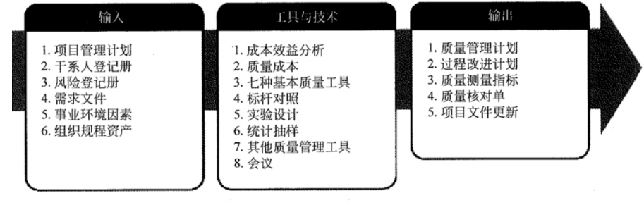
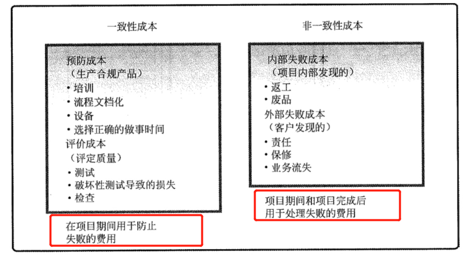
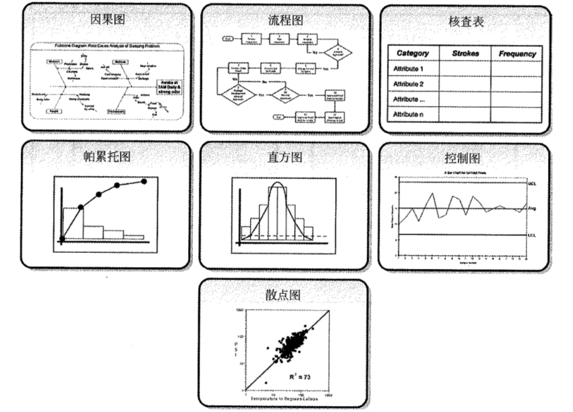
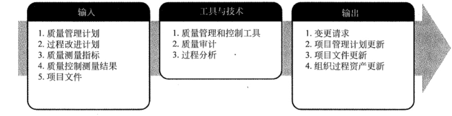
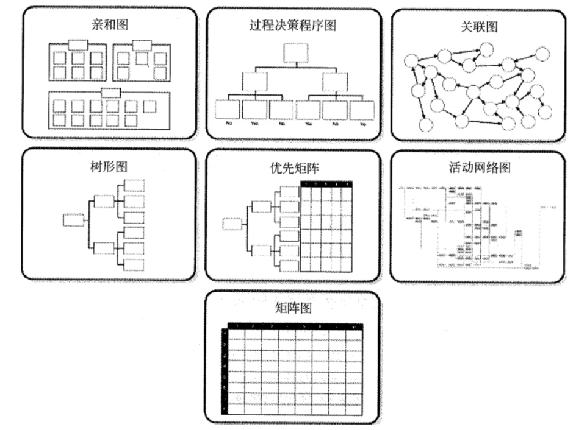
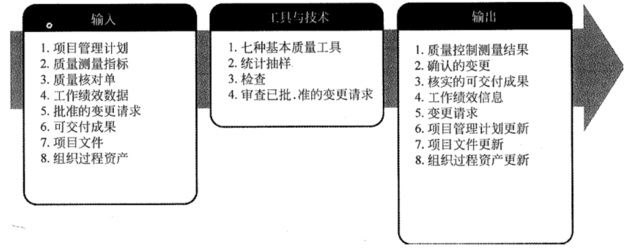

## 💥十大知识领域：项目质量管理

> 项目质量管理包括以下 3 个过程:
>
> * 规划质量管理
> * 实施质量保证
> * 质量控制

### 一、规划质量管理

> 规划质量管理是识别项目及其可交付成果的质量要求和标准，并准备对策确保符合质量要求的过程
>
> 这部分重点主要是**工具与技术**

1、成本效益分析

* 对每个质量活动进行成本效益分析，就是要比较其可能的成本与预期的效益
* 达到质量要求的主要效益包括减少返工、提高生产率、降低成本、提升干系人满意度及提升赢利能力

2、质量成本（图得背）

3、**七种基本质量工具（背）**

* **因果图**：（鱼骨图、石川图、石川馨图），用来`追溯问题来源，回推到可行动的根本原因`。通过看问题陈述和问"为什么来发现原因，直到发现可行动的根本原因，或者列尽每根鱼骨上的合理可能性
* **流程图**：（过程图），`用来显示在一个或多个输入转化成一个或多个输出的过程中，所需要的步骤顺序和可能分支`
3) **核查表**：（计数表），是用于`收集数据的查对清单`
3) **帕累托图**：80-20，二八原则，ABC 分析法，`抓重点原因`，用于识别造成大多数问题的少数重要原因
3) **直方图**：用于描述集中趋势、分散程度和统计`分布形状`
* **控制图**：`可以判断某一过程处于控制之中还是处于失控状态，和时间有关系`
* **散点图**：可以显示`两个变量之间是否有关系`，一条斜线上的数据点距离越近，两个变量之间的相关性就越密切

4、标杆对照

* 标杆对照是将实际或计划的项目实践与可比项目的实践进行对照，以便识别最佳实践，形成改进意见，并为绩效考核提供依据

5、实验设计

* 实验设计是一种统计方法，用来识别哪些因素会对正在生产的产品或正在开发的流程 的特定变量产生影响

6、统计抽样

7、其他质量管理工具

其他质量管理工具为定义质量要求并规划有效的质量管理活动，也可使用其他质量规划工具，包括(但不限于):

* 头脑风暴：用于产生创意的一种技术
* 力场分析：显示变更的推力和阻力的图形
* 名义小组技术：先由规模较小的群体进行头脑风暴，提出创意，再由规模较大的群体对创意进行评审

8、会议

9、输出：过程改进计划

* 过程改进计划是项目管理计划的子计划或组成部分。过程改进计划详细说明对项目管理过程和产品开发过程进行分析的各个步骤，以识别增值活动。

### 二、实施质量保证

> 实施质量保证是审计质量要求和质量控制测量结果，确保采用合理的质量标准和操作性定义的过程。
>
> 本过程的主要作用是：**促进质量过程改进**。
>
> 这部分重点主要是**工具与技术**

1、**质量审计的目标（案例题，背）**

* 识别全部正在实施的良好及最佳实践
* 识别全部违规做法、差距及不足
* 分享所在组织或行业中类似项目的良好实践
* 积极、主动地提供协助，以改进过程的执行，从而帮助团队提高生产效率
* 强调每次审计都应对组织经验教训的积累做出贡献。

2、过程分析

* 过程分析是指按照过程改进计划中概括的步来识别所需的改进。它也要检查在过程运行期间遇到的问题、制约因素，以及发现的非增值活动。过程分析包括根本原因分析--用于识别问题、探究根本原因，并制订预防措施的一种具体技术。

3、**质量管理和控制工具（背）**

* **亲和图**：针对某个问题，产生出可联成有组织的想法模式的各种创意。在项目管理中，`使用亲和图确定范围分解的结构，有助于 WBS 的制订`。
* **过程决策程序图**：（PDPC）用于`理解一个目标与达成此目标的步骤之间的关系`。PDPC 有助于制订应急计划，因为它能`帮助团队预测那些可能破坏目标实现的中间环节`。
* **关联图**：它是关系图的变种，有助于在包含`相互交叉逻辑关系`的中等复杂情形中创新性地解决问题。
* **树形图**：它也称系统图，可用于表现诸如 WBS、RBS 和 OBS 的层次分解结构。
* **优先矩阵**：用来识别关键事项和合适的备选方案，并通过一系列决策，排列出备选方案的优先顺序先对标准排序和加权，再应用于所有备选方案，计算出数学得分，`对备选方案排序`。
* **活动网络图**
* **矩阵图**：一种质量管理和控制工具，使用矩阵结构对数据进行分析。在行列交叉的位置展示因素、原因和目标之间的关系强弱。

### 三、质量控制

> 质量控制是监督并记录质量活动执行结果，以便评估绩效，并推荐必要的变更的过程。
>
> 本过程的主要作用包括：
>
> * 识别过程低效或产品质量低劣的原因，建议并采取相应措施消除这些原因
> * 确认项目的可交付成果及工作满足主要干系人的既定需求，足以进行最终验收

### 四、相对应到五大过程组（背）

|              | 启动过程组 | 计划过程组   | 执行过程组   | 控制过程组 | 收尾过程组 |
| ------------ | ---------- | ------------ | ------------ | ---------- | ---------- |
| 项目质量管理 |            | 规划质量管理 | 实施质量保证 | 质量控制   |            |

