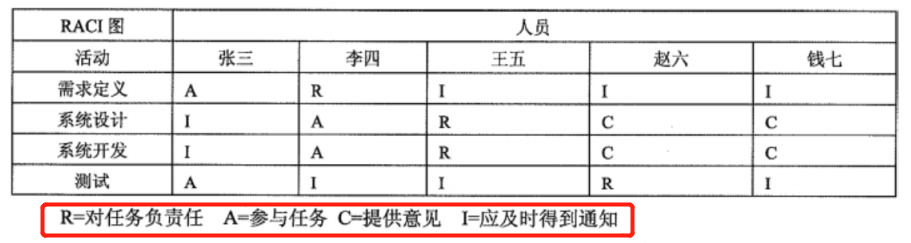

## 💥十大知识领域：项目资源管理

> 项目资源管理包括以下 4 个过程:
>
> * 编制项目人力资源计划
> * 组建项目团队
> * 建设项目团队
> * 管理项目团队

### 一、编制项目人力资源计划

> 确定与识别项目中的角色、所需技能、分配项目职责和汇报关系，并记录下来形成书面文件，其中也包括项目人员配备管理计划

| 输入                                                         | 工具与技术                                                   | 输出             |
| ------------------------------------------------------------ | ------------------------------------------------------------ | ---------------- |
| 项目管理计划 活动资源需求 事业环境因素 组织过程资产 | 组织分解结构(OBS) 资源分解结构(RBS) 责任分配矩阵(RAM) RACI 图 | 项目人力资源计划 |

1、RACI 图

### 二、组建项目团队

> 通过调配、招聘等方式得到需要的项目人力资源

| 输入                                                   | 工具与技术                                                   | 输出                                             |
| ------------------------------------------------------ | ------------------------------------------------------------ | ------------------------------------------------ |
| 项目人力资源管理计划 事业环境因素 组织过程资产 | 事先分派（预先分派） 谈判 招募 虚拟团队 多维决策分析 | 项目人员分配 表资源日历 项目管理计划更新 |

### 三、建设项目团队  

> 培养提高团队个人的技能，改进团队协作，提高团队的整体水平以提升项目绩效

| 输入                                                 | 工具与技术                                                   | 输出                              |
| ---------------------------------------------------- | ------------------------------------------------------------ | --------------------------------- |
| 项目人力资源管理计划 项目人员分派表 资源日历 | 人际关系技能 培训 团队建设活动 基本规则 集中办公 认可与奖励 人事测评工具 | 团队绩效评估 事业环境因素更新 |

1、优秀的团队不是一蹴而就的，一般要依次经历以下 5 个阶段。（案例题，背）

* **形成阶段**：一个个独立的个体成员转变为团队成员，开始形成共同目标，对未来团队往往有美好的期待
* **震荡阶段**：团队成员开始执行分配的任务，一般会遇到超出预想的困难，希望被现实打破。个体之间开始争执，互相指责，并且开始怀疑项目经理的能力
* **规范阶段**：经过一定时间的磨合，团队成员之间相互熟悉和了解，矛盾基本解决，项目经理能够得到团队的认可
* **发挥阶段**：随着相万之间的配合默契和对项目经理的信任，成员积极工作，努力实现目标。这时集体荣誉感非常强，常将团队换成第一称谓，如"我们那个组""我们部门"等，并会努力捍卫团队声誉
* **结束阶段**：随着项目的结束，团队也被遣散了。不管目前团队处于什么阶段，**新增加一个人或减少一个人，都是从形成阶段重新开始**

### 四、管理项目团队

> 跟踪团队成员个人的绩效和团队的绩效，提供反馈，解决问题并协调变更以提高项目绩效

| 输入                                                         | 工具与技术                                                | 输出                                                         |
| ------------------------------------------------------------ | --------------------------------------------------------- | ------------------------------------------------------------ |
| 项目人力资源管理计划 项目人员分派表 团队绩效评估 问题日志 绩效报告 组织文化和组织过程资产 | 观察和交谈 项目绩效评估 冲突管理 人际关系技能 | 变更请求 已更新的项目管理计划 项目文件更新 事业环境因素更新 己更新的组织过程资产 |

1、冲突管理的 6 种方法（案例题，背）

* **问题解决**：问题解决就是冲突各方一起积极地定义问题、收集问题的信息、制定解决方案，最后直到选择个最合适的方案来解决冲突，此时为双赢或多赢。但在这个过程中，需要公开地协商，这 是冲突管理中最理想的种方法
* **合作**：集合多方的观点和意见，得出一个多数人接受和承诺的冲突解决方案
* **强制**：强制就是以牺牲其他各方的观点为代价，强制采纳一方的观点
* **妥协**：妥协就是冲突的各方协商并且寻找一种能够使冲突各方都有一定程度满意、但冲突各方没有任何一方完全满意、是一种都做一些让步的冲突解决方法
* **求同存异**：求同存异的方法就是冲突各方都关注他们一致的一面，而淡化不一致的一面。一般求同存异要求保持一种友好的气氛，但是回避了解决冲突的根源。也就是让大家都冷静下来，先把工作做完
* **撤退**：撤退就是把眼前的或潜在的冲突搁置起来，从冲突中撤退。

### 五、相对应到五大过程组（背）

|              | 启动过程组 | 计划过程组           | 控制过程组                                     | 监控过程组 | 收尾过程组 |
| ------------ | ---------- | -------------------- | ---------------------------------------------- | ---------- | ---------- |
| 项目资源管理 |            | 编制项目人力资源计划 | 组建项目团队 建设项目团队 管理项目团队 |            |            |

