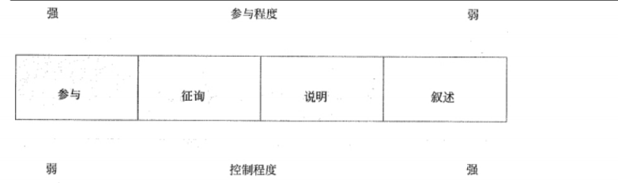

## 💥十大知识领域：项目沟通管理

> 项目沟通管理包括以下 3 个过程:
>
> * 制定沟通管理
> * 管理沟通
> * 控制沟通

### 一、制定沟通管理

| 输入                                                         | 工具与技术                                          | 输出             |
| ------------------------------------------------------------ | --------------------------------------------------- | ---------------- |
| 项目管理计划 干系人登记册 事业环境因素 组织过程资产 | 分析沟通需求 沟通技术 沟通模型 沟通方法 | 项目沟通管理计划 |

1、沟通方法

* **交互式沟通**：在两方或多方之间进行多向信息交换。容易达成共识，包括会议、电话、即时通信、视频会议等
* **推式沟通**：把信息发送给需要接收这些信息的特定接收方。这种方法可以确保信息的发送，但不能确保信息送达受众或被目标受众理解。推式沟通包括信件、备忘录、报告、电子邮件、传真、语音邮件、日志.新闻稿等
* **拉式沟通**：用于信息量很大或受众很多的情况。要求接收者自主、自行地访问信息内容。这种方法包括企业内网、电子在线课程、经验教训数据库、知识库等

### 二、管理沟通

| 输入                                                         | 工具与技术                                                   | 输出                                                         |
| ------------------------------------------------------------ | ------------------------------------------------------------ | ------------------------------------------------------------ |
| 项目沟通管理计划 工作绩效报告 事业环境因素 组织过程资产 | 沟通技术 沟通模型 沟通方法 信息管理系统 绩效报告 | 项目沟通 更新的项目管理计划 项目文件更新 更新的组织过程资产 |

### 三、控制沟通

| 输入                                                         | 工具与技术                         | 输出                                                         |
| ------------------------------------------------------------ | ---------------------------------- | ------------------------------------------------------------ |
| 项目管理计划 项目沟通 问题日志 工作绩效数据 组织过程资产 | 信息管理系统 专家判断 会议 | 工作绩效信息 变更请求 更新的项目管理计划 更新的其他项目文件 组织过程资产 |

### 四、相对应到五大过程组（背）

|              | 启动过程组 | 计划过程组   | 执行过程组 | 控制过程组 | 收尾过程组 |
| ------------ | ---------- | ------------ | ---------- | ---------- | ---------- |
| 项目沟通管理 |            | 制定沟通管理 | 管理沟通   | 控制沟通   |            |

### 五、补充知识点

1、沟通的方式

* 参与讨论方式
* 征询方式
* 推销方式（说明）
* 叙述方式

2、沟通的渠道从2个维度进行考虑：

* 及时性维度
* 表达方式维度

3、沟通结构的有效性，包括俩个重要方面：效果和效率

