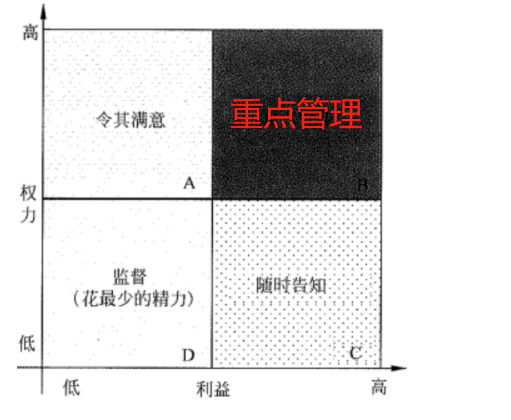

## 💥十大知识领域：项目干系人管理

> 项目干系人管理包括以下 4 个过程:
>
> * 识别干系人
> * 规划干系人管理
> * 管理干系人参与
> * 控制干系人参与

### 一、识别干系人

| 输入                                                    | 工具与技术                               | 输出         |
| ------------------------------------------------------- | ---------------------------------------- | ------------ |
| 项目章程 采购文件 事业环境因素 组织过程资产 | 组织相关会议 专家判断 干系人分析 | 干系人登记册 |

1、采购文件

* 如果项目是签订合同后才实施的，或者项目的一部分任务需要外包才能完成，那么合同各方都是关键的项目干系人，合同就是重要的采购文件。

2、干系人分析

* **权力/利益方格**：根据干系人的职权(权力)大小以及对项目结果的关注程度(利益)进行分组
* **权力/影响方格**：根据干系人的职权(权力)大小以及主动参与(影响)项目的程度进行分组
* **影响/作用方格**：根据干系人主动参与(影响)项目的程度以及改变项目计划或执行的能力(作用)进行分组
* **凸显模型**：根据干系人的权力(施加自己意愿的能力)、识别干系人紧急程度(需要立即关注)和合法性(有权参与),对干系人进行分类

2、权力/利益方格

### 二、规划干系人管理

> 随着项目的进展，干系人及其参与项目的程度可能发生变化，因此**规划干系人管理计划是一个反复的过程**，是
> 项目经理例行工作之一

| 输入                                                         | 工具与技术                             | 输出           |
| ------------------------------------------------------------ | -------------------------------------- | -------------- |
| 项目管理计划 干系人登记册 事业环境因素 组织过程资产 | 组织相关会议 专家判断 分析技术 | 干系人管理计划 |

### 三、管理干系人参与

| 输入                                                         | 工具与技术                             | 输出                                                         |
| ------------------------------------------------------------ | -------------------------------------- | ------------------------------------------------------------ |
| 干系人管理计划 沟通管理计划 变更日志 组织过程资产 | 沟通方法 人际关系技能 管理技能 | 问题日志 变更请求 项目管理计划更新 项目文件更新 组织过程资产更新 |

通常，**干系人对项目的影响能力通常在项目启动阶段最大，而后随着项目的进展逐渐降低**。因此，项目经理负责调动各干系人参与项目时，应尽早开展，并对他们进行管理，必要时可以寻求项目发起人的帮助，以降低项目的风险和阻力。

### 四、控制干系人参与

| 输入                                                    | 工具与技术                                 | 输出                                                         |
| ------------------------------------------------------- | ------------------------------------------ | ------------------------------------------------------------ |
| 项目管理计划 问题日志 工作绩效数据 项目文件 | 信息管理系统 专家判断 组织相关会议 | 工作绩效信息 变更请求 项目管理计划更新 项目文件更新 组织过程资产更新 |

### 五、相对应到五大过程组（背）

|                | 启动过程组 | 计划过程组     | 执行过程组     | 控制过程组     | 收尾过程组 |
| -------------- | ---------- | -------------- | -------------- | -------------- | ---------- |
| 项目干系人管理 | 识别干系人 | 规划干系人管理 | 管理干系人参与 | 控制干系人参与 |            |

