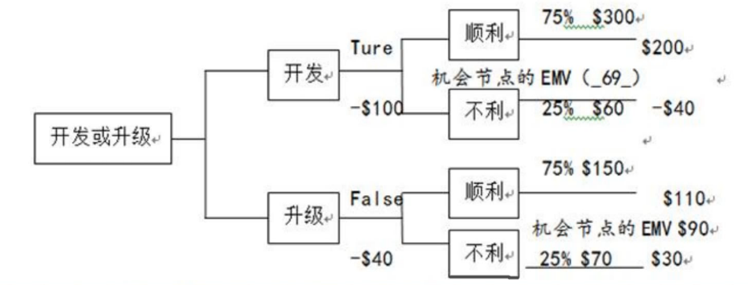
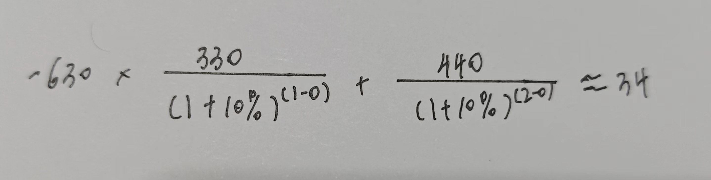

### 一、决策树和期望货币值

1、项目经理向客户推荐了四种供应商选择方案。每个方案损益值已标在下面的决策树上。根据预期收益值，应选择设备供应商 

* A.供应商1
* B.供应商2
* C.供应商3
* D.供应商4

解题：

* 供应商 1：60% * 10000 + （-30000）* 40% = 48000
* 供应商 2：90% * 50000 + （-10000）* 10% = 44000
* 供应商 3：99% * 10000 + （-1000）* 1% = 9890
* 供应商 4：80% * 20000 + （-10000）* 20% = 14000

结果：选择供应商 4

2、决策树分析法通常用决策树图表进行分析，根据下表的决策树分析法计算，图中机会节点的预期收益EMV分别是 90 和（\_69\_）(单位:万元)

* A.160
* B.150 
* C.140 
* D.100

 

解题：75% * 200 + 25% * （-40） = 140

结果：选择开发节点的 EMV 为 140

 

### 二、加权计算

1、在对某项目采购供应商的评价中，评价项有:技术能力、管理水平、企业资质等，假定满分为10分，技术能力权重为20%，三个评定人的技术能力打分分别为7分，8分，9分，那么该供应商的“技术能力”的单项综合分为

* A.24
* B.8
* C.4.8
* D.1.6

解题：

先计算出三位专家给到分数的平均值：（7 + 8 + 9）/ 3

在进行**加权计算**：（7 + 8 + 9）/ 3 * 20% = 1.6

结果：选 D

 

### 三、自制和外购分析

1、评估和选择最佳系统设计方案时，甲认为可以采用点值评估方法，即根据每一个价值因素的重要性，综合打分在选择最佳的方案。乙根据甲的提议，对系统 A 和系统 B 进行评估，评估结果如下表所示，那么乙认为 (25)

* A.最佳方案是 A
* B.最佳方案是 B
* C.条件不足，不能得出结论
* D.只能用成本/效益分析方法做出判断*

解题：

* 供应商 A：90 * 40% + 80 * 40% + 80 * 20% = 84
* 供应商 B：80 * 40% + 85 * 40% + 90 * 20% = 84

结果：选 C

2、某项目实施需要甲产品，若自制，单位产品的可变成本为 12 元，并需另外购买一台专用设备，该设备价格为 4000 元:若采购，购买量大于 3000 件购买价格为 13 元/件，购买量少于3000件时，购买价为 14 元/件，则甲产品用量 (66)时，外购为宜；甲产品用量 (67)时，自制为宜。

(66)

* A、小于 2000 件
* B、大于 2000 件，小于 3000 件时
* C、小于 3000 件
* D、大于 3000 件

(67) 

* A、小于 2000 件
* C、小于 3000 件
* B、大于 2000 件，小于 3000 件时
* D、大于 3000 件

解题：

* 分析：
  * 自制：12 元 / 件 + 4000
  * 采购：大于 3000 13 元 / 件；小于 3000 14 元 / 件

小于 3000 的情况：12x + 4000 = 14x  解得：x = 2000

* 当 x > 2000，自制 > 采购
* 当 2000 < x < 3000，自制 < 采购

大于 3000 的情况：12x + 4000 = 13x   解得：x = 4000

* 当 x > 4000，自制 > 采购
* 当 3000 < x < 4000，自制 < 采购

结果：（66）A ；（67）B

 

### 四、沟通渠道

1、你正在组织项目沟通协调会，参加会议的人数为 12人，沟通渠道有 () 条。

* A、66
* B、72
* C、96
* D、132

解题：公式 （n *（n - 1）） / 2

结果：12 * （12 - 1） /  2 = 66；选 A 

2、某软件的工作量是 2000 行，由4人组成的开发小组开发，每个程序员的生产效率是 500 行/人月，每对程序员的沟通成本是 250 行/人月，则该软件需要开发多少个月

* A、1
* B、1.04
* C、1.05
* D、1.08

解题：(4 * (4 - 1) / 2) * 250 * N + 20000 = 4 * 5000 * N；解得 N = 1.08

结果：选 D 

 

### 五、三点估算 PERT

1、完成活动 A 所需的时间，悲观 (P)的估计需 36 天，最可能 (ML)的估计需 21 天，乐观 (0)的估计需 6 天。活动 A 在 16 天至 26 天内完成的概率是多少

* A、55.70%
* B、68.26%
* C、95.43%
* D、99.73%

前置知识：

* 计算可能值公式：（a：理想情况；b：正常情况；c：悲观情况）
  * （a + 4b + c）/ 6 （β 分布情况）
  * （a + 4b + c）/ 3 （三角分布情况）
* 计算标准差：\| c - a | / 6

2、完成某信息系统集成项目中的一个最基本的工作单元A所需的时间，乐观的估计需8天，悲观的估计需38天，最可能的估计需20天，按照PERI方法进行估，项目的工期应该为 (37)，在26天以后完成的概率大致为 (38)

(37) 

* A、20
* B、21
* C、22
* D、23

(38) 

* A、8.9% 
* B、15.9%
* C、22.2%
* D、28.6%

 

### 六、投资回收期、净现值

1、某项目各期的现金流量如表所示:

| 期数       | 0    | 1    | 2    |
| ---------- | ---- | ---- | ---- |
| 净现金流量 | -630 | 330  | 440  |

设贴现率为 10%，则项目的净现值约为 ()。

* A、140
* B、70
* C、34
* D、6

2、甲乙丙为三个独立项目，NPV甲 =12万元，NPVZ=15万元，NPV丙18万元，三个项目的初始投资额相同，并且回收期相同，则应优先选择 (69) 项目进行投资

* A、甲
* B、乙
* C、 丙
* D、甲或乙

选 NPV 最大的，选 C（前题：`初始投资额相同，并且回收期相同`）

3、某一项目，初始投资为 2000万元，该项目从投产年开始每年的净收益如下表所示，则该项目的静态投资回收期约为( )年。

* A、2.9
* B、3.9
* C、2.7
* D、3.8

| 2011 年      | 2012年         | 2013年         | 2014年        | 2015年        |
| ------------ | -------------- | -------------- | ------------- | ------------- |
| 投入2000万元 | 净收益 600万元 | 净收益 700万元 | 净收益800万元 | 净收益500万元 |

 

### 七、进度网络计算题

1、单代号网络图

六标时图

**正推取大（红色）；反推取小（绿色）**

关键路径：ACDE（关键路径下的活动总浮动时间都是 0）

浮动时间（总时长）： LS - ES = LF - EF （浮动时间可能为 负数）

活动的自由时差：**Min(紧后活动的ES) - 活动的EF**（如：活动 C 的自由时差  Min(20, 35) - 20 = 20 - 20 = 0）  

关键路径上的总时差总是为0或者负数，如果出现负数应该尽快解决，使之等于 0

计算题：一项任务的最早开始时间是第3天，最晚开始时间是第13天，最早完成时间是第9天，最晚完成时间是第19天。该任务 (40)

* A.在关键路径上 
* B.有滞后 
* C.进展情况良好 
* D.不在关键路径上

解题：

| 3    | 6    | 9    |
| ---- | ---- | ---- |
|      |      |      |
| 13   | 10   | 19   |

结果：选 D

2、双代号网络图

* 波浪线代表该活动的自由时差
* 每个活动的总时差：从该活动开始后续所有路径波浪线之和最小的值
  * 计算哪个工作的总时差，就以哪个工作为起点工作(一定要注意，既不是从头算，也不是从该工作的紧后算，而是从该工作开始算)，寻找通过该工作的所有线路，然后计算各条线路的波形线的长度和，该工作的总时差=波形线长度和的最小值。

计算题：

（1）绘制项目计划的双代号网络图

（2）请给出项目计划工期及关键路径

* 关键路径：A -> D -> G -> I -> J  
* 工期：60 + 20 + 30 + 25 + 35 = 170

（3）请按照计划分别计算活动 A 和 B 的总时差

* A：0
* B：20 + 30 + 25 - 45 = 30

（4）项目要求 150 天完工，请写出关键路径上可压缩的活动成本变化情况。请绘出成本最优的压缩工期的方案和总成本的变化情况

解题：

要求 150 天完工，说明要压缩 20 天，关键路径可以压缩的活动有 d、g、i

* d 活动可压缩 10 天，原成本为 1400 元，压缩后变为 1100 元，可节约成本 300 元。
* g 活动可压缩 10 天，原成本为 2700 元，压缩后变为 2500 元，可节约成本 200 元。
* i 活动可压缩 10 天，原成本为 1562.5 元，压缩后变为 1372.5 元，可节约成本 190 元。

因为次关键路径 aehi=150 天，所以只需要压关键路径上活动即可，不会导致关键路径的变化。

从上面可知，成本最优方案为活动 d 压缩 10 天，活动 g 压缩 10 天。

压缩前总成本为 23378 元，压缩后总成本为 22878 元，节约成本 500 元。

（5）请写出压缩工期为 150 天后的项目关键路径。

 

### 八、挣值分析、预测技术