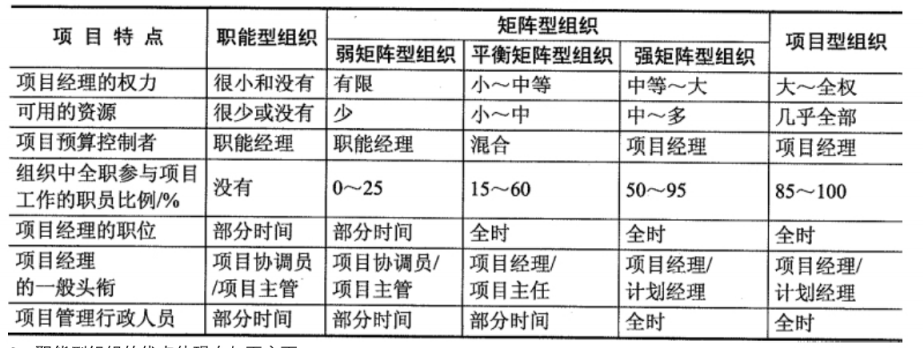
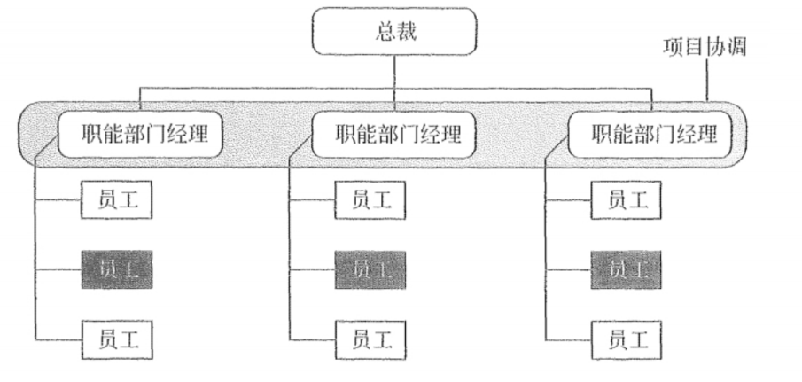
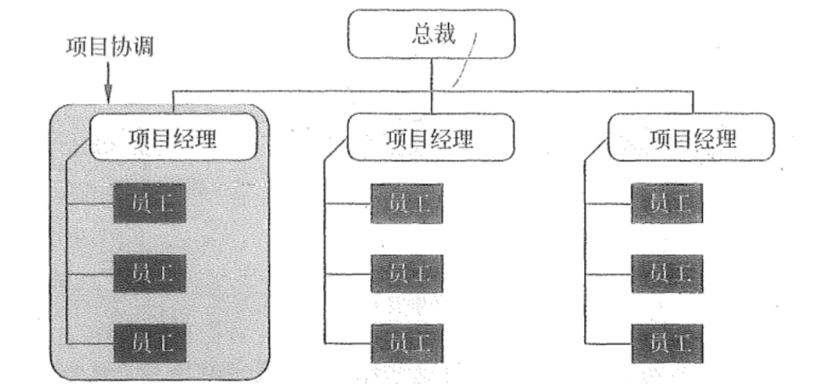
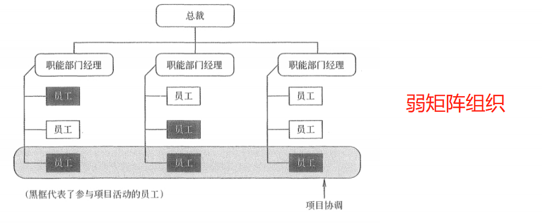
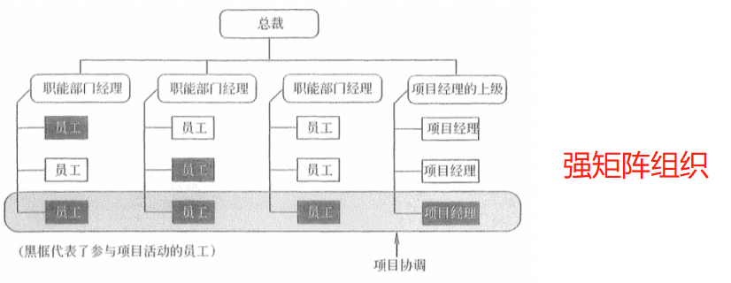
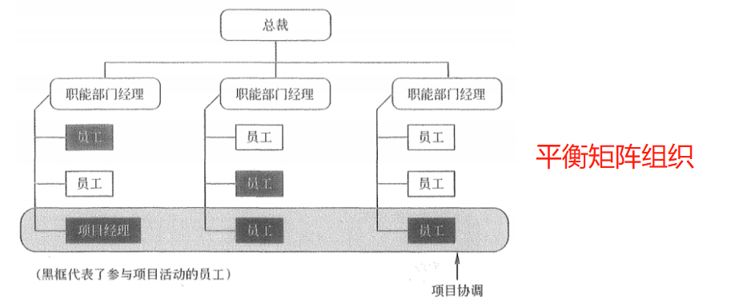
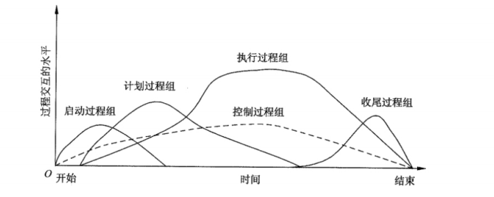

## 💥项目管理一般知识

### 一、什么是项目

1、项目定义

项目是为达到特定的目的，使用一定资源，在确定的期间内，为特定发起人提供独特的产品、服务或成果而进行的一系列相互关联的活动的集合。项目有完整的生命周期，有开始，有结束，具有一次性、临时性的特点。项目是为创造独特的产品、服务或成果而进行的临时性工作。

2、项目目标

* 成果性目标（项目目标）
* 约束性目标（管理性目标）

3、项目的目标要求遵守SMART原则

* Specific(具体的) 
* Measurable(可测量的)
* Attainable(可以达到的)
* Relevant(有相关性的)
* Time-bound(有明确时限的)

4、项目目标具有如下特性

* 项目的目标有不同的优先级
* 项目目标具有层次性

5、项目的特点

* 临时性 
* 独特性 
* 渐进明细

6、 每个项目的关键干系人除客户和用户外，还包括如下一些人

* 项目经理
* 执行组织
* 项目团队及其成员
* 项目发起人
* 职能经理
* 影响者
* 项目管理办公室(PMO)

### 二、项目组织结构

#### 1 职能型组织

优点：

* 强大的技术支持，便于知识、技能和经验的交流
* 清晰的职业生涯晋升路线
* 直线沟通、交流简单、责任和权限很清晰
* 有利于重复性工作为主的过程管理。

缺点：

*  职能利益优先于项目，具有狭隘性组织横向之间的联系薄弱、部门间沟通协调难度大
* 项目经理极少或缺少权利、权威，项目管理发展方向不明，缺少项目基准等

#### 2 项目型组织

优点：

* 结构单一，责权分明，利于统一指挥
* 目标明确单一
* 沟通简洁、方便
* 决策快

缺点：

* 管理成本过高
* 项目环境比较封闭，不利于沟通、技术知识等共享
* 员工缺乏事业上的连续型和保障

#### 3 矩阵型组织

优点：

* 项目经理负责制、有明确的项目目标
* 改善了项目经理对整体资源的控制
* 及时响应
* 获得职能组织更多的支持
* 最大限度地利用公司的稀缺资源
* 降低了跨职能部门间的协调合作难度
* 使质量、成本、时间等制约因素得到更好的平衡
* 团队成员有归属感，士气高，问题少
* 出现的冲突较少，且易处理解决

缺点

* 管理成本增加：**多头领导**
* 难以监测和控制
* 资源分配与项目优先的问题产生冲突
* 权利难以保持平衡等

### 三 、项目过程组

* 启动过程组：定义并批准项目或阶段
* 计划编制过程组：定义和细化目标，规划最佳的技术方案和管理计划，以实现项目或阶段所承担的目标和范围
* 执行过程组：整合人员和其他资源，在项目的生命期或某个阶段执行项目管理计划，并得到输出与成果
* 监督与控制过程组(监控过程组)：要求定期测量和监控进展、识别实际绩效与项目管理计划的偏差、必要时采取纠正措施，或管理变更以确保项目或阶段目标达成
* 收尾过程组：正式接受产品、服务或工作成果，有序地结束项目或阶段。

项目或阶段收尾时，可能需要进行以下工作:

1. 获得客户或发起人的验收，以正式结束项目或阶段
2. 进行项目后评价或阶段结束评价
3. 记录裁剪任何过程的影响
4. 记录经验教训
5. 对组织过程资产进行适当更新
6. 将所有相关项目文件在项目管理信息系统中归档，以便作为历史数据使用
7. 结束所有采购活动，确保所有相关协议的完结
8. 对团队成员进行评估，释放项目资源

工作绩效数据、工作绩效信息、工作绩效报告

* 工作绩效数据：在执行项目工作的过程中，从每个正在执行的活动中收集到的原始观察结果和测量值。例如：工作完成百分比、质量和技术绩效测量值、进度活动的开始和结束日期、变更请求的数量、缺陷数量、实际成本和实际持续时间等

* 工作绩效信息：从各控制过程中收集并结合相关背景和跨领域关系，进行整合分析而得到的绩效数据。

* 工作绩效报告：为制定决策、提出问题、采取行动或引起关注，而汇编工作绩效信息，所形成的实物或电子项目文件。例如，状况报告、备忘录、论证报告、信息札记、电子报表、推荐意见或情况更新。

  