# 飞书应用开发

## 🎉 自建应用

### 🎨 创建自建应用

[地址](https://open.feishu.cn/app/)

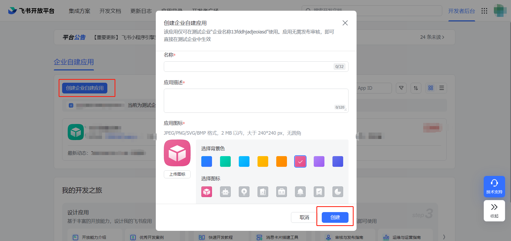

<hr/>

### 🎨 自建应用凭证

点击创建的应用即可查看到凭证，这俩个值很重要，后续都要用到这俩个参数

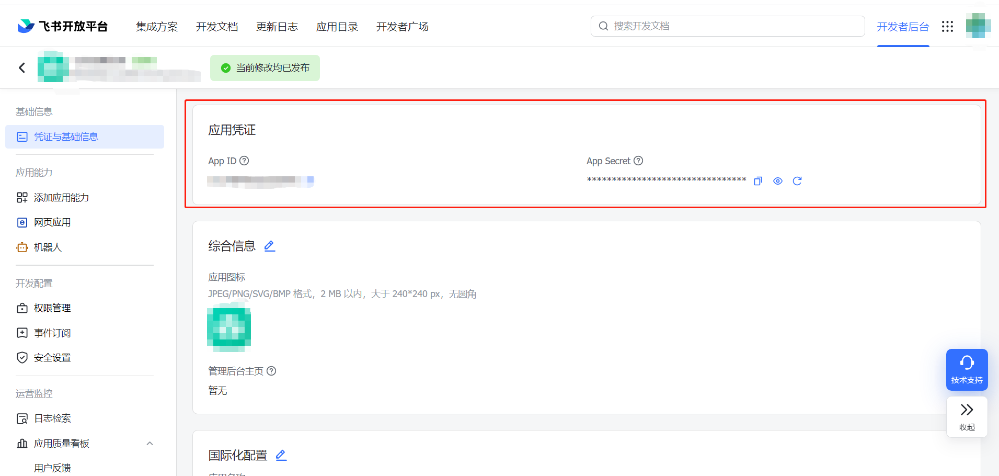

<hr/>

### 🎨 设置应用可用范围

[地址](https://test-cupj5ov53nu0.feishu.cn/admin)

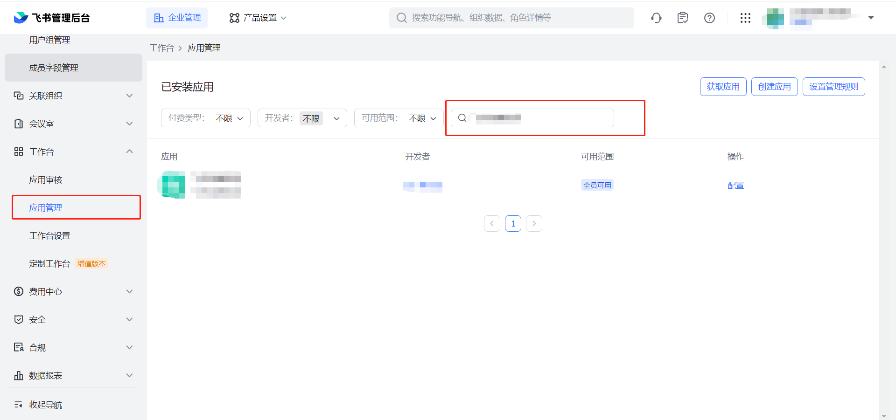

默认的可见范围是全体成员，可以点击配置来修改其可见范围

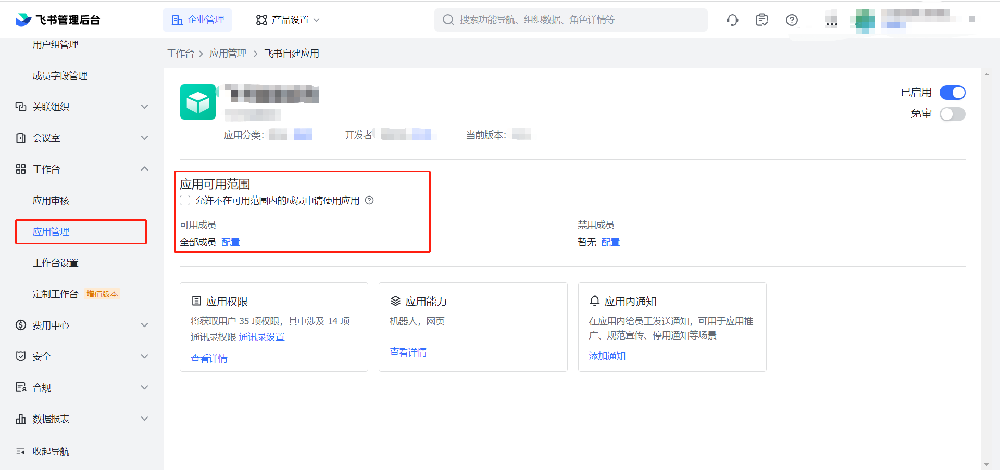

✨ 需注意的地方：当配置了应用可见范围后，应用权限中获取通讯录权限，默认是跟可用人员范围保持一致。若要同步企业组织架构时，需要将其重新设置成全员

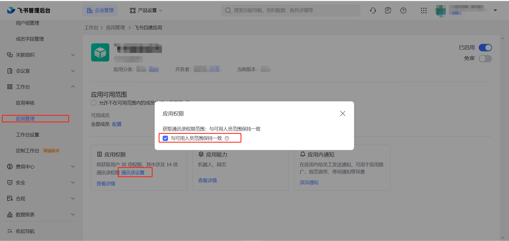

> 此步操作业务场景：每个企业都有自己的自建应用，并且应用并不是所有成员可以使用的。如审批系统，只有上级或部门主管才能有此功能。
>
> 设置了可见范围后，登录到飞书应用，打开工作台，可以看到只有在可用范围的成员才可以查看到该应用。

<hr/>

### 🎨 获取应用可用范围

飞书开放平台，提供了接口可以获取到应用的可用范围

> url：https://open.feishu.cn/open-apis/application/v2/app/visibility
>
> method：GET
>
> 支持的应用类型：自建应用
>
> 权限要求：获取应用信息

请求头

| 名称          | 类型   | 必填 | 描述                                     |
| ------------- | ------ | ---- | ---------------------------------------- |
| Authorization | string | 是   | Bearer `tenant_access_token`（下文细讲） |
| Content-Type  | string | 是   | application/json; charset=utf-8          |

请求参数

| 参数            | 类型   | 必须 | 说明                                                    |
| --------------- | ------ | ---- | ------------------------------------------------------- |
| app_id          | string | 是   | 目标应用的 ID                                           |
| user_page_token | string | 否   | 分页拉取用户列表起始位置标示，不填表示从头开始          |
| user_page_size  | int    | 否   | 本次拉取用户列表最大个数(最大值 1000 ，0 自动最大个数 ) |

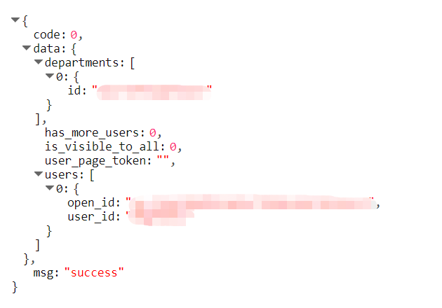

> 此步操作业务场景：获取到应用的可用范围，可以向具有该应用可用范围的成员推送审批通知。点击审批通知中携带链接，即可将审批人员带到企业内部自己的审批系统。此步点击操作进入到企业内部的审批系统，系统还需要知道点击者是谁。后续内容会涉及。

[地址](https://open.feishu.cn/document/server-docs/application-v6/admin/obtain-the-app-availability-in-an-organization )

<hr/>

## 🎉 获取接口凭证

飞书提供了三种凭证支持调用开放平台的接口。其区别：这里不细讲[地址](https://open.feishu.cn/document/server-docs/api-call-guide/calling-process/get-access-token)，说了也是照抄过来的。在实际操作中，主要是用到 `tenant_access_token` 凭证。

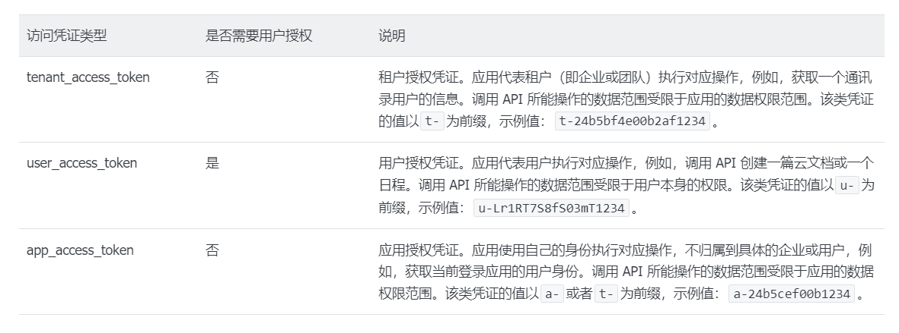

这里就说一下，如何获取 `tenant_access_token`。同样这个值也是很关键，后续请求都会使用到该凭证

> url: https://open.feishu.cn/open-apis/auth/v3/tenant_access_token/internal
>
> method: POST
>
> 支持的应用类型：仅自建应用
>
> 权限要求：无

请求头

| 名称         | 类型   | 必填 | 描述                                          |
| ------------ | ------ | ---- | --------------------------------------------- |
| Content-Type | string | 是   | **固定值**：“application/json; charset=utf-8” |

请求体

| 名称       | 类型   | 必填 | 描述                         |
| ---------- | ------ | ---- | ---------------------------- |
| app_id     | string | 是   | 应用唯一标识，创建应用后获得 |
| app_secret | string | 是   | 应用秘钥，创建应用后获得     |

` tenant_access_token` 是有过期时间的，最大有效期是 2 小时。

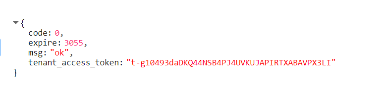

✨ 注：如果在有效期小于 30 分钟的情况下，调用本接口，会返回一个新的 tenant_access_token，这会同时存在两个有效 tenant_access_token

因此，每次发送请求时需要判断一下该值是否已失效，若失效需要重新获取。

[地址](https://open.feishu.cn/document/server-docs/authentication-management/access-token/tenant_access_token_internal)

<hr/>

## 🎉 三方扫码登录

### 🎨 整体流程

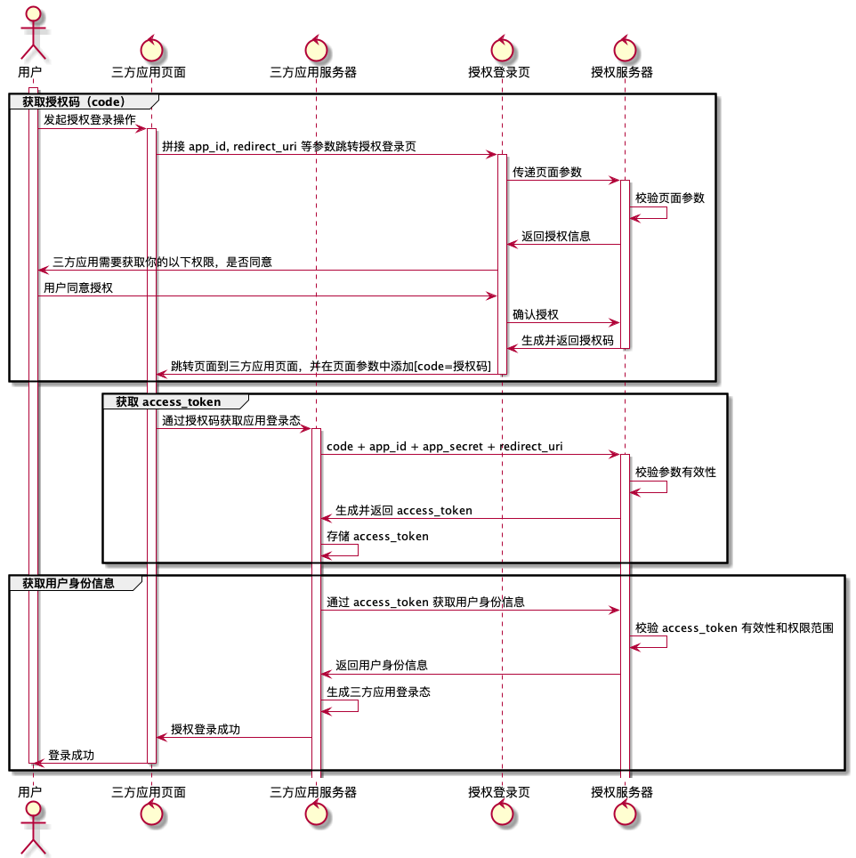

<hr/>

### 🎨 获取 Code

> url：https://passport.feishu.cn/suite/passport/oauth/authorize
>
> method: get

请求参数


注：

* 使用 window.QRLogin 获取二维码时需要通过 qrcode 来获取和生成，可引入 JS 文件[地址](https://sf3-cn.feishucdn.com/obj/feishu-static/lark/passport/qrcode/LarkSSOSDKWebQRCode-1.0.2.js)

* 需要设置安全重定向地址（扫码成功后，需要跳转的地址）

  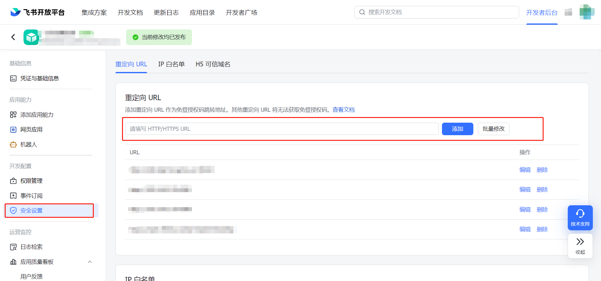

扫码成功后，可以看到地址栏会重定向到在安全设置中设置的地址，并且在地址后面会拼接 `code` 码，这个很关键，后续会用到该值

代码实现：

```vue
<template>
   <div id="login_container"></div>
</template>
<script setup>
import { onMounted, onBeforeUnmount, ref, watch } from "vue";
import settings from "@/setting";
import axios from "axios";   
    
const gotoURL = ref("");
const redirectUri = ref("");
const QRLoginObj = ref({});
    
// 步骤一：获取二维码，扫码获取 code
const qr_login = async () => {
  // 扫码成功重定向地址
  redirectUri.value = `${settings.REDIRECT_URL}`;
  // 获取 二维码 地址
  gotoURL.value = `https://passport.feishu.cn/suite/passport/oauth/authorize?client_id=${settings.APP_ID}&redirect_uri=${redirectUri.value}&response_type=code&state=STATE`;
  QRLoginObj.value = window.QRLogin({
    id: "login_container",
    goto: gotoURL.value,
    width: "300",
    height: "300",
    style: "border:none;"
  });
};
    
// 监听扫码事件
const handleMessage = async (event) => {
  const loginTmpCode = event.data;
  const origin = event.origin;
  if (QRLoginObj.value.matchOrigin(origin)) {
    // 关键  
    window.location.href = `${gotoURL.value}&tmp_code=${loginTmpCode}`;
  }
};  
    
onMounted(() => {
  qr_login();
  window.addEventListener("message", handleMessage, false);
});

onBeforeUnmount(() => {
  window.removeEventListener("message", handleMessage, false);
});    
</script>
```


[地址](https://open.feishu.cn/document/common-capabilities/sso/web-application-sso/web-app-overview#3bc4d3a8)

<hr/>

### 🎨 获取 Access_token

通过上一步操作获取到的 `code ` 码，来获取 `access_token` 。

> url：https://passport.feishu.cn/suite/passport/oauth/token
>
> method：POST

请求头

| 字段           | 值                                  |
| -------------- | ----------------------------------- |
| `Content-Type` | `application/x-www-form-urlencoded` |

请求参数

| 参数            | 描述                                                     | 类型     | 是否必须                         |
| --------------- | -------------------------------------------------------- | -------- | -------------------------------- |
| `grant_type`    | 此处必须是 authorization_code                            | `string` | 是                               |
| `client_id`     | 应用的唯一ID，在开发者后台【凭证和基础信息】中可以获得   | `string` | 是                               |
| `client_secret` | 应用的密钥信息，在开发者后台【凭证和基础信息】中可以获得 | `string` | 否                               |
| `code`          | 步骤一生成的 code                                        | `string` | 是                               |
| `redirect_uri`  | 步骤一设置的 redirect_ur                                 | `string` | **移动端登录：否 Web端登录：是** |

✨ 注：官方建议此步操作换取 access_token，最好是不要将 access_token 发送给前端，要保证其安全。

代码实现：

```vue
<script setup>
import { useRouter } from "vue-router";
const router = useRouter();
    
const tokenData = ref({});
const getToken = () => { 
    // TODO： 获取 access_token
    tokenData.value = ''
}

// 监听路由是否携带 code
watch(
  () => router.currentRoute.value,
  (route) => {
    if (route.query.code) {
      getToken(route.query.code);
    }
  },
  { immediate: true }
);    
</script>
```

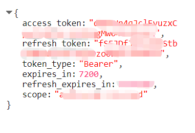

[地址](https://open.feishu.cn/document/common-capabilities/sso/api/get-access_token)

<hr/>

### 🎨 获取用户信息

> url：https://passport.feishu.cn/suite/passport/oauth/userinfo
>
> method：GET

请求头

| 字段            | 值                       |
| --------------- | ------------------------ |
| `Authorization` | `Bearer ${access_token}` |

实现代码：

```vue
<script setup>
const userInfoData = ref({});

// 步骤三：通过 access_token 获取用户信息
const getUserInfoByToken = () => {
  axios
    .get("/Api/suite/passport/oauth/userinfo", {
      headers: {
        Authorization: `Bearer ${tokenData.value.access_token}`,
      },
    })
    .then((res) => {
      userInfoData.value = res.data;
    });
};
</script>
```

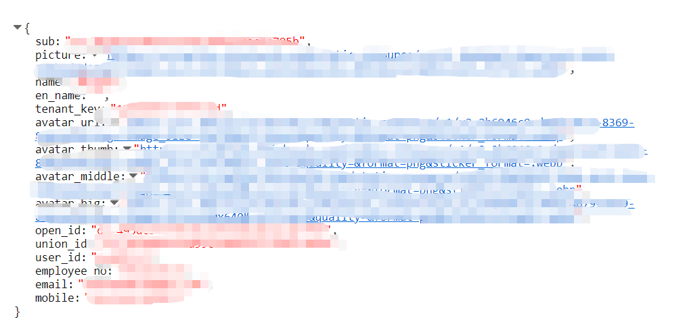

[地址](https://open.feishu.cn/document/common-capabilities/sso/api/get-user-info)

<hr/>

## 🎉 组织架构

分别需要使用到飞书开放平台的接口有三条：[获取部门下子部门列表](https://open.feishu.cn/document/server-docs/contact-v3/department/children)，[获取部门下直属用户](https://open.feishu.cn/document/server-docs/contact-v3/user/find_by_department)，[获取单个部门信息](https://open.feishu.cn/document/server-docs/contact-v3/department/get)，[获取单个用户信息](https://open.feishu.cn/document/server-docs/contact-v3/user/get) 。具体细节看文档，很详细。这里主要是讲一下我是如何通过这几条接口进行企业组织架构的获取及事件订阅

```javascript
const renderCorganization = async () => {
  // 获取凭证
  const tokenRes = await getTenantAccessToken({
    app_id: settings.APP_ID,
    app_secret: settings.APP_SECRET,
  });
  const token = tokenRes.data.tenant_access_token;

  const rootId = 0; // 根部门 默认 0
  const headers = {
    Authorization: `Bearer ${token}`,
  };

  // 获取根部门信息
  const rootDepRes = await getDepartmentsById(
    {
      department_id: rootId,
      department_id_type: "department_id",
      user_id_type: "user_id",
    },
    { headers }
  );
  const rootData = rootDepRes.data.data.department || {};

  // 获取子部门列表
  const childrenDepRes = await getChildrenDeparments(
    {
      department_id: rootId,
      department_id_type: "department_id",
      user_id_type: "user_id",
      fetch_child: true,
    },
    { headers }
  );
  const childList = childrenDepRes.data.data.items || [];

  // 获取子部门直属用户列表
  for (let i = 0; i < childList.length; i++) {
    const child = childList[i];
    const id = child.department_id;
    const userListRes = await getUserByDepartments(
      {
        department_id: id,
        department_id_type: "department_id",
        user_id_type: "user_id",
      },
      { headers }
    );
    const userList = userListRes.data.data.items || [];
    child.userList = userList;

    // 是否有负责人
    if (child.leader_user_id) {
      const leaderData = userList.find(
        (item) => item.user_id === child.leader_user_id
      );
      child.leader_data = leaderData || {};
    }
  }

  // 生成树 (返回的数据是没有层级的，每个节点中知道其父节点)
  const data = generateDepartmentTree(childList, rootData);
  treeData.value = data;
    
  // 由于 element-plus 中 el-tree 子节点是 children 故需要讲 leaderData 和 userList 放到 children 中  
  generateTree(data.children);
    
  // 此时：treeData 是由层级结构，可以通过 el-tree 进行渲染  
};

const generateDepartmentTree = (data, root) => {
  const map = {};
  const tree = [];

  // 创建一个映射，将每个部门的 ID 与其对应的对象关联起来
  data.forEach((department) => {
      map[department.department_id] = department;
      department.children = [];
  });

  if (root.department_id) {
      map[root.department_id] = Object.assign(root, { children: [] })
  }

  // 遍历每个部门，将其添加到其父部门的 children 数组中
  data.forEach((department) => {
      const parent = map[department.parent_department_id];
      if (parent) {
          parent.children.push(department);
      } else {
          tree.push(department);
      }
  });

  return map[root.department_id] || [];
}

const generateTree = (data) => {
  for (let i = 0; i < data.length; i++) {
    const child = data[i];
    if (child.userList && child.userList.length != 0) {
      if (!child.children) {
        child.children = [];
      }
      if (child.leader_data) {
        child.children.unshift(child.leader_data)
        child.userList = child.userList.filter(item => {
          return item.user_id !== child.leader_data.user_id
        })  
      }
      child.children = [...child.children, ...child.userList]
      generateTree(child.children)
    }
  }
   return data
}
```

✨ 注：若没有全员通讯录权限，则无法同步全员的组织架构


飞书也提供了批量获取部门信息和用户信息，具体可以看一下官网。

<hr/>

## 🎉 事件订阅

通过配置后端地址，一旦组织架构发生变化时（成员信息修改，新增成员等），第一时间会通知后端，进行组织架构的同步。

### 🎈 配置订阅地址

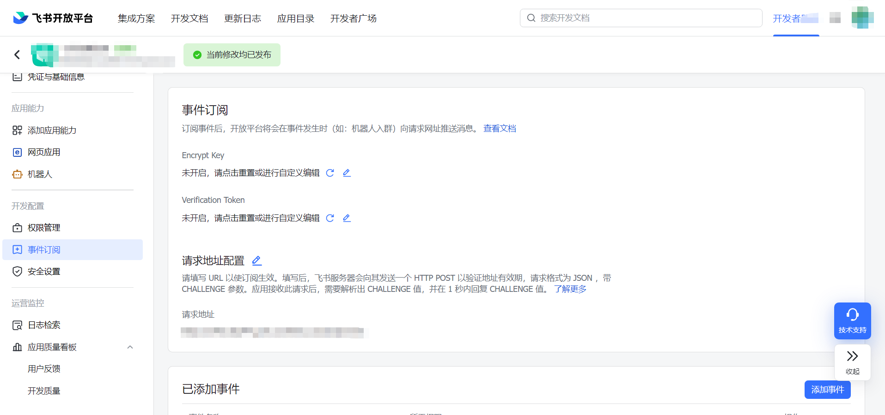

```javascript
const router = require('koa-router')()
router.prefix('/api')

router.post('/event', async (ctx, next) => {

    // 接口第一次设置，需要校验
    const { challenge } = ctx.request.body;
    
    const data = ctx.request.body;
    // 事件对象
    console.log(data);
    
    // TODO: 同步组织架构
    
    ctx.body = {
        challenge: challenge
    }
})
module.exports = router
```

### 🎈 订阅事件

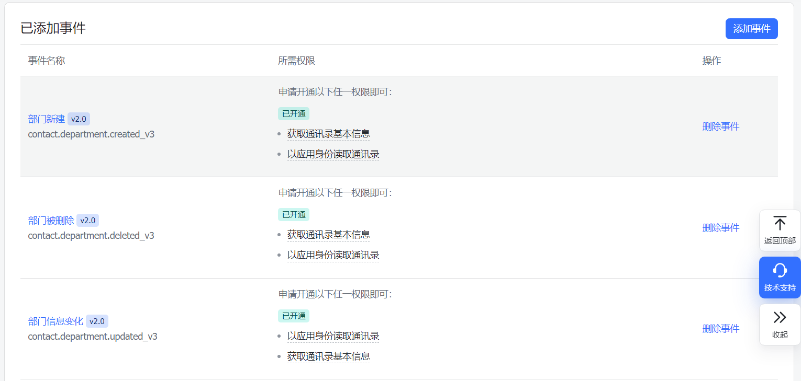

✨ 注：若没有全员通讯录权限，则事件通知只有通知在可用范围内组织架构的变动，当可用范围以外的组织架构发生变动是不会进行通知的

<hr/>

## 🎉 通知推送

[消息推送](https://open.feishu.cn/document/server-docs/im-v1/message/create)，[消息批量推送](https://open.feishu.cn/document/server-docs/im-v1/batch_message/send-messages-in-batches)；这里主要是讲一下某种场景下的使用：当企业员工需要进行请假申请时，而请假申请是企业内部的系统。跟飞书是没有关系。只不过需要通过飞书来推送通知，将通知推送给到自己的上级。问题来：**上级点击通知中的链接，进入到企业内部的请假系统。那企业内部的系统怎么知道谁点击了这条申请。**

✨ 注：此功能需要开启机器人能力

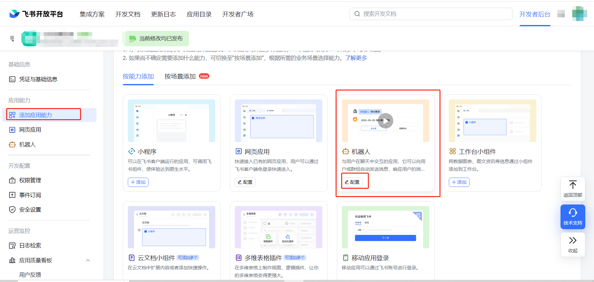

原理：审批者在跳转到目标系统前，先访问飞书平台，获取到审批者用户凭证 `code` 码，然后飞书连同`code` 码，将其重定向到目标系统。而目标系统可以通过该 `code` 码来获取到审批者消息。

### 🎈 获取登录授权码

> url：https://open.feishu.cn/open-apis/authen/v1/index?redirect_uri={REDIRECT_URI}&app_id={APPID}&state={STATE}
>
> method：GET
>
> 支持的应用类型：自建应用、商店应用
>
> 权限要求：无

查询参数

| **名称**     | **类型** | **必填** | **描述**                                                     |
| ------------ | -------- | -------- | ------------------------------------------------------------ |
| redirect_uri | string   | 是       | 重定向 URL                                                   |
| app_id       | string   | 是       | 应用 ID                                                      |
| state        | string   | 否       | 用来维护请求和回调状态的附加字符串， 在授权完成回调时会附加此参数，应用可以根据此字符串来判断上下文关系 |

✨ 注 ` redirect_uri ` 也需要进行设置


<hr/>

### 🎈 获取审批者消息

> url：https://open.feishu.cn/open-apis/authen/v1/access_token
>
> method：POST
>
> 支持的应用类型：自建应用、商店应用
>
> 权限要求：无
>
> 字段权限要求：
>
> * 获取用户受雇信息
> * 获取用户邮箱信息（仅自建应用）
> * 获取用户 user ID（仅自建应用）
> * 获取用户手机号（仅自建应用）

请求头

| 名称          | 类型   | 必填 | 描述                                                         |
| ------------- | ------ | ---- | ------------------------------------------------------------ |
| Authorization | string | 是   | Bearer `app_access_token`[地址](https://open.feishu.cn/document/server-docs/authentication-management/access-token/app_access_token_internal) |
| Content-Type  | string | 是   | "application/json; charset=utf-8"                            |

响应数据

```json
{
    "code": 0,
    "msg": "success",
    "data": {
        "access_token": "u-Q7JWnaIM_kRChuLfreHmpArjOEayt.5XUBJcZr.V0Gst4FdQCtvrd9sAViLXQnQgkpL19brGOjKZQTxb",
        "token_type": "Bearer",
        "expires_in": 7140,
        "name": "zhangsan",
        "en_name": "Three Zhang",
        "avatar_url": "www.feishu.cn/avatar/icon",
        "avatar_thumb": "www.feishu.cn/avatar/icon_thumb",
        "avatar_middle": "www.feishu.cn/avatar/icon_middle",
        "avatar_big": "www.feishu.cn/avatar/icon_big",
        "open_id": "ou_caecc734c2e3328a62489fe0648c4b98779515d3",
        "union_id": "on_d89jhsdhjsajkda7828enjdj328ydhhw3u43yjhdj",
        "email": "zhangsan@feishu.cn",
        "enterprise_email": "demo@mail.com",
        "user_id": "5d9bdxxx",
        "mobile": "+86130002883xx",
        "tenant_key": "736588c92lxf175d",
        "refresh_expires_in": 2591940,
        "refresh_token": "ur-oQ0mMq6MCcueAv0pwx2fQQhxqv__CbLu6G8ySFwafeKww2Def2BJdOkW3.9gCFM.LBQgFri901QaqeuL",
        "sid": "AAAAAAAAAANjgHsqKEAAEw=="
    }
}
```